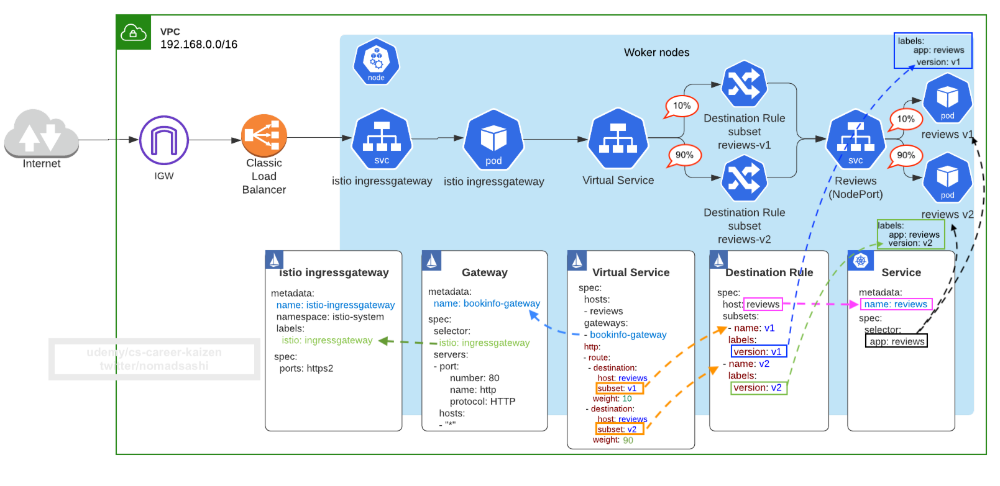
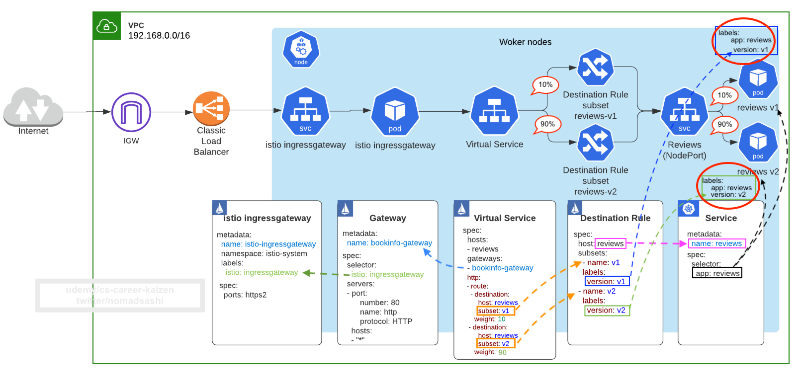
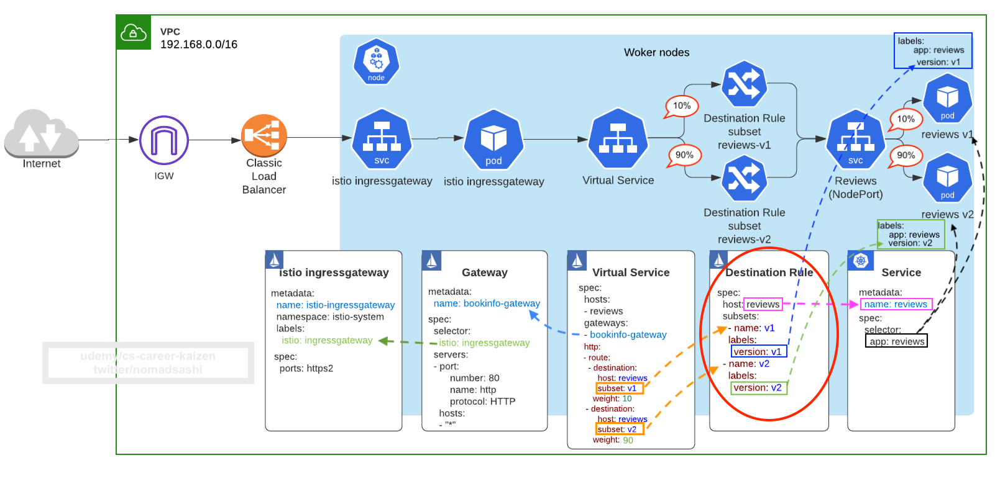
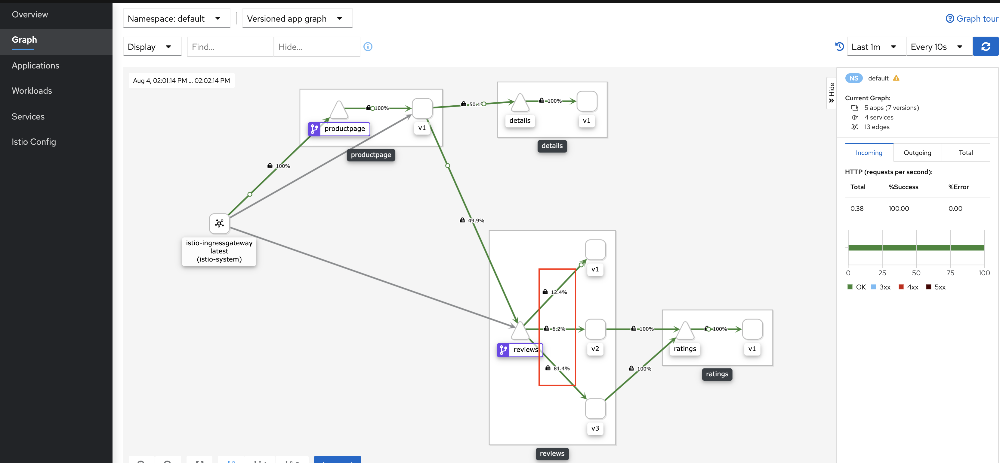
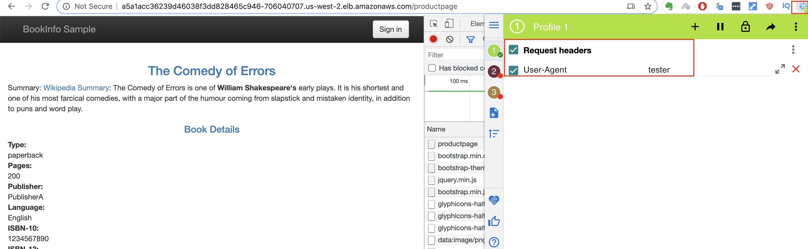
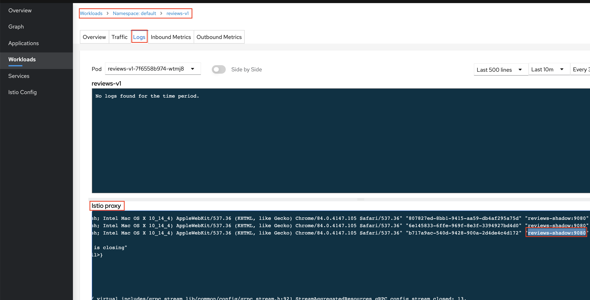
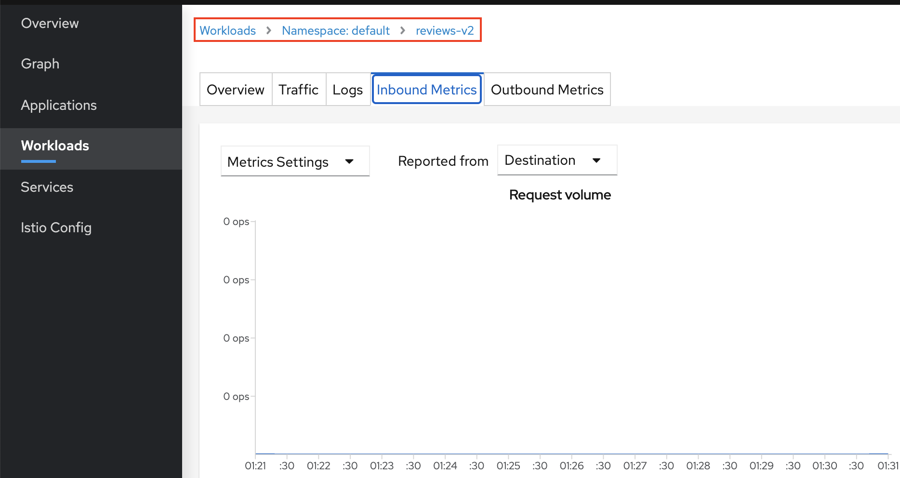
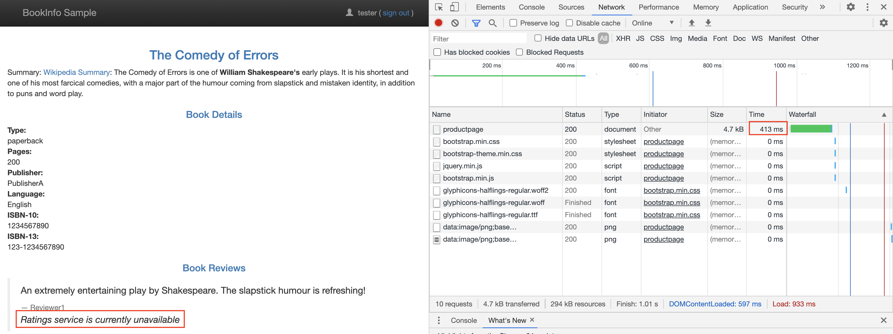

## Traffic Splitting (i.e. Canary, weight-based routing) using Virtual Service Subset



### Step 1: Add version label to pods



```sh
# check pod labels for pod with app=reviews
kubectl get pod --show-labels --selector app=reviews

# output
NAME                          READY   STATUS    RESTARTS   AGE   LABELS
reviews-v1-7f6558b974-wtmj8   2/2     Running   0          23h   app=reviews,istio.io/rev=default,pod-template-hash=7f6558b974,security.istio.io/tlsMode=istio,service.istio.io/canonical-name=reviews,service.istio.io/canonical-revision=v1,version=v1
reviews-v2-6cb6ccd848-hrpbg   2/2     Running   0          23h   app=reviews,istio.io/rev=default,pod-template-hash=6cb6ccd848,security.istio.io/tlsMode=istio,service.istio.io/canonical-name=reviews,service.istio.io/canonical-revision=v2,version=v2
reviews-v3-cc56b578-dg7gq     2/2     Running   0          23h   app=reviews,istio.io/rev=default,pod-template-hash=cc56b578,security.istio.io/tlsMode=istio,service.istio.io/canonical-name=reviews,service.istio.io/canonical-revision=v3,version=v3
```

Notice three different `reviews` pods have `version=v1`, `version=v2`, and `version=v3`. These pods are created from three separate deployments.

```sh
kubectl get deploy --selector app=reviews

# output
NAME         READY   UP-TO-DATE   AVAILABLE   AGE
reviews-v1   1/1     1            1           23h
reviews-v2   1/1     1            1           23h
reviews-v3   1/1     1            1           23h
```

You can also see this on `Kiali` dashboard
```sh
# open kiali dashboard
istioctl dashboard kiali
```


However, they are proxied by one service using `app=reviews` label
```sh
# show reviews service and its labels
kubectl get svc reviews --show-labels

# output
NAME      TYPE        CLUSTER-IP     EXTERNAL-IP   PORT(S)    AGE   LABELS
reviews   ClusterIP   10.100.5.108   <none>        9080/TCP   23h   app=reviews,service=reviews
```


### Step 2: Create Istio DestinationRule resource



A subset/version of a route destination is identified with a reference to a named service subset which must be declared in a corresponding DestinationRule.


#### DestinationRule Anatomy
In [destination_rules_versioning.yaml](destination_rules_versioning.yaml),
```yaml
apiVersion: networking.istio.io/v1alpha3
kind: DestinationRule
metadata:
  name: reviews
spec:
  host: reviews # name of a service from the service registry (in-cluster or could be external)
  trafficPolicy: # service-level traffic policy
      loadBalancer:
        simple: ROUND_ROBIN # default, so you don't need to specify it explicitly
  subsets: # One or more named sets that represent individual versions of a service. Traffic policies can be overridden at subset level.
  - name: v1 # <--- named version/subset
    labels:
      version: v1 # label attached to Pod definition
  - name: v2
    labels:
      version: v2
  - name: v3
    labels:
      version: v3
```

Breakdown:
- host
    - name of a service from the service registry. 
    - __in-cluster__ service: looked up from Kubernetes services
    - __external__ (from K8s) service: looked up from the hosts declared by __ServiceEntries__
- trafficPolicy (more in details in coming sections)
    - load balancing policy
        - round robin, random, least connection
    - connection pool sizes
        - controlling the volume of connections to an upstream service
    - outlier detection
        - controlling eviction of unhealthy hosts from the load balancing pool
- subset
    - One or more __named sets that represent individual versions of a service__
    - trafficPolicy
        - Traffic policies can be overridden at subset level.


Apply 
```sh
kubectl apply -f destination_rules_versioning.yaml

# check
kubectl get dr
NAME      HOST      AGE
reviews   reviews   5s
```


### Step 3: Add Subset and Weight to route destination in Virtual Service


In [virtualservice_reviews_canary.yaml](virtualservice_reviews_canary.yaml),
```yaml
apiVersion: networking.istio.io/v1alpha3
kind: VirtualService
metadata:
  name: reviews
spec:
  hosts: # destinations that these routing rules apply to. VirtualService must be bound to the gateway and must have one or more hosts that match the hosts specified in a server
  - reviews
  gateways: # names of gateways and sidecars that should apply these routes
  - bookinfo-gateway # Don't ONLY USE this gateway as "reviews" k8s service is used internally by productpage service, so this VS rule should be applied to Envoy sidecar proxy inside reviews pod, not edge proxy in gateway pod. 
  - mesh # applies to all the sidecars in the mesh. The reserved word mesh is used to imply all the sidecars in the mesh. When gateway field is omitted, the default gateway (mesh) will be used, which would apply the rule to all sidecars in the mesh. If a list of gateway names is provided, the rules will apply only to the gateways. To apply the rules to both gateways and sidecars, specify mesh as one of the gateway names. Ref: https://istio.io/latest/docs/reference/config/networking/virtual-service/#VirtualService
  http: # L7 load balancing by http path and host, just like K8s ingress resource
  - route:
    - destination:
        host: reviews
        subset: v1
      weight: 10 # <--- canary release. % of traffic to subset v1
    - destination:
        host: reviews
        subset: v2
      weight: 10
    - destination:
        host: reviews
        subset: v3
      weight: 80
```

Apply 
```sh
kubectl apply -f virtualservice_reviews_canary.yaml

# check
kubectl get vs
NAME      HOST      AGE
reviews   reviews   5s
```


### Step 4: Test and Verify Canary Traffic Splitting
Go to browser, now you should see 10% of time reviews is v1 (no stars) and v2 (black stars) respectively, and 80% of time v3 (red stars)

```sh
echo $(kubectl -n istio-system get service istio-ingressgateway -o jsonpath='{.status.loadBalancer.ingress[0].hostname}')/productpage

# check this from browser
a5a1acc36239d46038f3dd828465c946-706040707.us-west-2.elb.amazonaws.com/productpage

# or make arbitrary # of requests from curl
for i in {1..20}; do curl $(echo $(kubectl -n istio-system get service istio-ingressgateway -o jsonpath='{.status.loadBalancer.ingress[0].hostname}')/productpage); done
```


```sh
# open kiali dashboard
istioctl dashboard kiali
```
Go to `kiali` dashboard -> Graph -> select `default` namespace > select Display dropdown and check off "Traffic Animation"


Then dashboard will show request percentage


You can also see request tracing/metrics from Service > Reviews > Traces


## Identity-Based Routing
Ref: https://istio.io/latest/docs/reference/config/networking/virtual-service/#HTTPMatchRequest


In [virtualservice_reviews_header_condition_identity_based.yaml](virtualservice_reviews_header_condition_identity_based.yaml),
```yaml
apiVersion: networking.istio.io/v1alpha3
kind: VirtualService
metadata:
  name: reviews
spec:
  hosts: # destinations that these routing rules apply to. VirtualService must be bound to the gateway and must have one or more hosts that match the hosts specified in a server
  - reviews
  gateways: # names of gateways and sidecars that should apply these routes
  - bookinfo-gateway # Don't ONLY USE this gateway as "reviews" k8s service is used internally by productpage service, so this VS rule should be applied to Envoy sidecar proxy inside reviews pod, not edge proxy in gateway pod. 
  - mesh # applies to all the sidecars in the mesh. The reserved word mesh is used to imply all the sidecars in the mesh. When gateway field is omitted, the default gateway (mesh) will be used, which would apply the rule to all sidecars in the mesh. If a list of gateway names is provided, the rules will apply only to the gateways. To apply the rules to both gateways and sidecars, specify mesh as one of the gateway names. Ref: https://istio.io/latest/docs/reference/config/networking/virtual-service/#VirtualService
  http: # L7 load balancing by http path and host, just like K8s ingress resource
  - match: # <---- this routing to apply to all requests from the specifieduser
    - headers: # Note: The keys uri, scheme, method, and authority will be ignored.
        end-user: # WARNING: merely passing this key-value pair in curl won't work as productpage service won't propagate custom header attributes to review service! You need to login as a user Ref: https://stackoverflow.com/a/50878208/1528958
          exact: log-in-as-this-user
    route:
    - destination:
        host: reviews
        subset: v1 # then route traffic destined to reviews (defined in hosts above) to backend reviews service of version 1
  - route:
    - destination:
        host: reviews
        subset: v1
      weight: 10 # <--- canary release. % of traffic to subset v1
    - destination:
        host: reviews
        subset: v2
      weight: 10
    - destination:
        host: reviews
        subset: v3
      weight: 80
  # - match: # <---- DON'T DO THIS as rules are evaluated in order
  #   - headers:
  #       end-user:
  #         exact: tester
  #   route:
  #   - destination:
  #       host: reviews
  #       subset: v1
```

You can add match conditions to http
```yaml
- match:
   - headers:
       end-user:
         exact: tester
```

Apply
```
kubectl apply -f virtualservice_reviews_header_condition_identity_based.yaml 
```

## How to Test
#### Warning: passing custom header attributes using browser plugin or curl won't work, as productpage app won't propagate those attributes to reviews app. Usually these work but not with `bookinfo` app:

### WON'T WORK:
~~From a browser, install `ModHeader` chrome plugin so you can modify HTTP header~~


~~And you will see reviews v1, which is just texts without stars.~~


~~From curl, make requests with header attribute~~
```sh
for i in {1..20}; do curl --verbose \
    --header "user-agent: tester" \
    $(echo $(kubectl -n istio-system get service istio-ingressgateway -o jsonpath='{.status.loadBalancer.ingress[0].hostname}')/productpage); done
```


#### WORKS:
You login to bookinfo page as an user.


Kiali shows traffic is routed to reviews v1


## Query String Condition Routing


In [virtualservice_reviews_header_condition_query_string.yaml](virtualservice_reviews_header_condition_query_string.yaml),
```yaml
  http: # L7 load balancing by http path and host, just like K8s ingress resource
  - match:
    - queryParams: # <----- query parameter
        test-v2:
          exact: "true" # if "?test-v2=true" in query string. NOTE: prefix not supported for queryString
    route:
    - destination:
        host: reviews
        subset: v2 # then route traffic destined to reviews (defined in hosts above) to backend reviews service of version ２
```

Unfortunately, `productpage` app won't pass along header info including query string parameters to `reviews` app, so this can't be tested


## URI (HTTP path) Condition Routing


In [virtualservice_reviews_header_condition_uri.yaml](virtualservice_reviews_header_condition_uri.yaml),
```yaml
  http: # L7 load balancing by http path and host, just like K8s ingress resource
  - match:
    - uri:
        regex: '^/productpage/v2' # could be exact|prefix|regex
      ignoreUriCase: true
    route:
    - destination:
        host: reviews
        subset: v2 # then route traffic destined to reviews (defined in hosts above) to backend reviews service of version ２
```

Unfortunately, `productpage` app won't pass along header info including query string parameters to `reviews` app, so this can't be tested


## Inject Latency Delay for Resilience Testing using VirtualService
Refs: 
- https://istio.io/latest/docs/reference/config/networking/virtual-service/#HTTPFaultInjection-Delay
- https://istio.io/latest/docs/concepts/traffic-management/#fault-injection


> Delays: Delays are timing failures. They mimic increased network latency or an overloaded upstream service

In [virtualservice_ratings_fault_injection_delay.yaml](virtualservice_ratings_fault_injection_delay.yaml),
```yaml
apiVersion: networking.istio.io/v1alpha3
kind: VirtualService
metadata:
  name: ratings
spec:
  hosts: # destinations that these routing rules apply to. VirtualService must be bound to the gateway and must have one or more hosts that match the hosts specified in a server
  - ratings
  http: # L7 load balancing by http path and host, just like K8s ingress resource
  - match:
    - headers: # Note: The keys uri, scheme, method, and authority will be ignored.
        end-user: # WARNING: merely passing this key-value pair in curl won't work as productpage service won't propagate custom header attributes to review service! You need to login as a user Ref: https://stackoverflow.com/a/50878208/1528958
          exact: tester
    fault: 
      delay: # <------ inject latency 
        percentage:
          value: 100.0 # Percentage number in the range of [0.0, 100.0]. Ref: https://istio.io/latest/docs/reference/config/networking/virtual-service/#Percent
        fixedDelay: 10s # <----- delay
    route:
    - destination:
        host: ratings
        subset: v1
  - route:
    - destination:
        host: ratings
        subset: v1
```


Apply 
```
kubectl apply -f virtualservice_ratings_fault_injection_delay.yaml
```

Login as `tester` and access it from browser.


You expect the Bookinfo home page to load without errors in approximately __7-10 seconds__. However, the Reviews section displays an error message: `Sorry, product reviews are currently unavailable for this book.` 

This was the result of `productpage` receiving the timeout error from the `reviews` service, which couldn't get a response from `ratings` service which has 10s delay within `productpage` timeout (default application-level timeout of 3s times 1 retry = 7s).

```
productpage -> (3s timeout x 1 retry = max 6s) -> reviews -> ratings with 10s delay
```


You can also check the delay from Developer Tools menu > Network tab > Reload the /productpage web page, and you see __7s__ latency:


From Kiali


### Why 7 second latency despite 10s delay?
Ref: https://istio.io/latest/docs/tasks/traffic-management/fault-injection/#understanding-what-happened

> Timeout between the `reviews` and `ratings` service is __hard-coded at 10s__. However, there is also a hard-coded timeout between the `productpage` and the `reviews` service, coded as __3s + 1 retry for 6s__ total. As a result, the productpage call to reviews times out prematurely and throws an error after __6s__.

## Mirror Live Traffic using VirtualService
Refs:
- https://istio.io/latest/docs/tasks/traffic-management/mirroring/
- https://istio.io/latest/docs/reference/config/networking/virtual-service/#HTTPRoute


Mirroring sends a copy of live traffic to a mirrored service.

When traffic gets mirrored, the requests are sent to the mirrored service with their __Host/Authority headers appended with -shadow__. For example, cluster-1 becomes cluster-1-shadow.

In [virtualservice_reviews_mirror.yaml](virtualservice_reviews_mirror.yaml),
```yaml
apiVersion: networking.istio.io/v1alpha3
kind: VirtualService
metadata:
  name: reviews
spec:
  hosts: # destinations that these routing rules apply to. VirtualService must be bound to the gateway and must have one or more hosts that match the hosts specified in a server
  - reviews
  gateways: # names of gateways and sidecars that should apply these routes
  - bookinfo-gateway # Don't ONLY USE this gateway as "reviews" k8s service is used internally by productpage service, so this VS rule should be applied to Envoy sidecar proxy inside reviews pod, not edge proxy in gateway pod. 
  - mesh # applies to all the sidecars in the mesh. The reserved word mesh is used to imply all the sidecars in the mesh. When gateway field is omitted, the default gateway (mesh) will be used, which would apply the rule to all sidecars in the mesh. If a list of gateway names is provided, the rules will apply only to the gateways. To apply the rules to both gateways and sidecars, specify mesh as one of the gateway names. Ref: https://istio.io/latest/docs/reference/config/networking/virtual-service/#VirtualService
  http: # L7 load balancing by http path and host, just like K8s ingress resource
  - mirror: # <---- mirror traffic going to v3 to v1 as well, 100% of it
      host: reviews
      subset: v1
    mirror_percent: 100.0 # use double. https://istio.io/latest/docs/reference/config/networking/virtual-service/#HTTPRoute
    route:
    - destination:
        host: reviews
        subset: v3
      weight: 100
```

Apply
```sh
# apply normal ratings virtual service without delay nor abort
kubectl apply -f virtualservice_ratings.yaml 

kubectl apply -f virtualservice_reviews_mirror.yaml 
```

Visit the URL from browser

You can see traffic to v3:


v1 is mirroring the traffic:


And v1's istio proxy log shows __header host__ is appended with `-shadow` as in `reviews-shadow`



However, v2 isn't receiving any traffic.


## Return Arbitrary HTTP Response for Resilience Testing using VirtualService
Refs: 
- https://istio.io/latest/docs/reference/config/networking/virtual-service/#HTTPFaultInjection-Abort
- https://istio.io/latest/docs/concepts/traffic-management/#fault-injection


Aborts: Aborts are crash failures. They mimic failures in upstream services. Aborts usually manifest in the form of HTTP error codes or TCP connection failures.

In [virtualservice_ratings_fault_injection_abort.yaml](virtualservice_ratings_fault_injection_abort.yaml),
```yaml
apiVersion: networking.istio.io/v1alpha3
kind: VirtualService
metadata:
  name: ratings
spec:
  hosts: # destinations that these routing rules apply to. VirtualService must be bound to the gateway and must have one or more hosts that match the hosts specified in a server
  - ratings
  http: # L7 load balancing by http path and host, just like K8s ingress resource
  - match:
    - headers: # Note: The keys uri, scheme, method, and authority will be ignored.
        end-user: # WARNING: merely passing this key-value pair in curl won't work as productpage service won't propagate custom header attributes to review service! You need to login as a user Ref: https://stackoverflow.com/a/50878208/1528958
          exact: tester
    fault: 
      abort: # <----- return pre-specified HTTP code
        percentage:
          value: 100.0 # Percentage number in the range of [0.0, 100.0]. Ref: https://istio.io/latest/docs/reference/config/networking/virtual-service/#Percent
        httpStatus: 400
    route:
    - destination:
        host: ratings
        subset: v1
  - route:
    - destination:
        host: ratings
        subset: v1
```


Apply 
```
kubectl apply -f virtualservice_ratings_fault_injection_abort.yaml
```

Login as `tester` and access it from browser, the page loads __immediately__, as opposed to 7s delay like previous section, and the Ratings service is currently unavailable message appears. 



Now you see red line from `reviews` pod to `ratings` service in Kiali.


## Configure Load Balancing Policy using Destination Rule
Refs:
- https://istio.io/latest/docs/concepts/traffic-management/#destination-rule-example
- https://istio.io/latest/docs/reference/config/networking/destination-rule/


> Destination Rule defines policies that apply to traffic intended for a service after routing has occurred

Destination Rule can configure:
- load balancing algorithm (random, least connection, round robin)
- connection pool size from the sidecar
- outlier detection settings to detect and evict unhealthy hosts from the load balancing pool

Without Istio DestinationRule's Traffic Policy, by default you are left with K8s service's L4 load balancing (round robin by default).

With Istio DestinationRule's Traffic Policy, you could control and split traffic to subset/versioned pods, and __among those pods you can configure fine-graied LB algorithms__ such as __round robin__, __random__, __least-connection__, __sticky sessions__, etc


### Round Robin Load Balancing (default)
```yaml
apiVersion: networking.istio.io/v1alpha3
kind: DestinationRule
metadata:
  name: reviews
spec:
  host: reviews # name of a service from the service registry
#   trafficPolicy: # service-level routing policy
#       loadBalancer:
#         simple: ROUND_ROBIN # default, so you don't need to specify it explicitly
```

### Random Load Balancing
It selects a random healthy host. The random load balancer generally performs better than round robin if no health checking policy is configured.

```yaml
apiVersion: networking.istio.io/v1alpha3
kind: DestinationRule
metadata:
  name: reviews
spec:
  host: reviews
  trafficPolicy: # service-level routing policy
      loadBalancer:
        simple: RANDOM # selects a random healthy host
```

### Least request load balancing
This uses an O(1) algorithm which selects two random healthy hosts and picks the host which has fewer active requests.
```yaml
apiVersion: networking.istio.io/v1alpha3
kind: DestinationRule
metadata:
  name: reviews
spec:
  host: reviews
  trafficPolicy: # service-level routing policy
      loadBalancer:
        simple: LEAST_CONN # selects two random healthy hosts and picks the host which has fewer active requests
```

### Multiple Load Balancing Rules for Subsets
In this example, we define:
- service-level trafficPolicy for `loadBalancer` and specify `ROUND_ROBIN`
- version specific trafficPolicy for `loadBalancer` and specify `LEAST_CONN` for subset `v1`
- `RANDOM` for subset `v2`
```yaml
apiVersion: networking.istio.io/v1alpha3
kind: DestinationRule
metadata:
  name: reviews
spec:
  host: reviews # name of a service from the service registry (in-cluster or could be external)
  trafficPolicy: # service-level traffic policy
    loadBalancer:
      simple: ROUND_ROBIN # default, so you don't need to specify it explicitly
  subsets: # One or more named sets that represent individual versions of a service. Traffic policies can be overridden at subset level.
  - name: v1
    labels:
      version: v1 # label attached to Pod definition
    trafficPolicy: # Version specific policies, which overrides service-level traffic 
      loadBalancer:
        simple: LEAST_CONN
  - name: v2
    labels:
      version: v2
    trafficPolicy: # Version specific policies, which overrides service-level traffic policy
      loadBalancer:
        simple: RANDOM
```

## Enable Sticky Session for Load Balancing in DestinationRule
```yaml
apiVersion: networking.istio.io/v1alpha3
kind: DestinationRule
metadata:
  name: reviews
spec:
  host: reviews # name of a service from the service registry
  trafficPolicy: # service-level routing policy
    loadBalancer:
        consistentHash: # <--- changed from "simple"
            httpCookie:
                name: user # Name of the cookie.
                ttl: 1800s # Lifetime of the cookie
```
