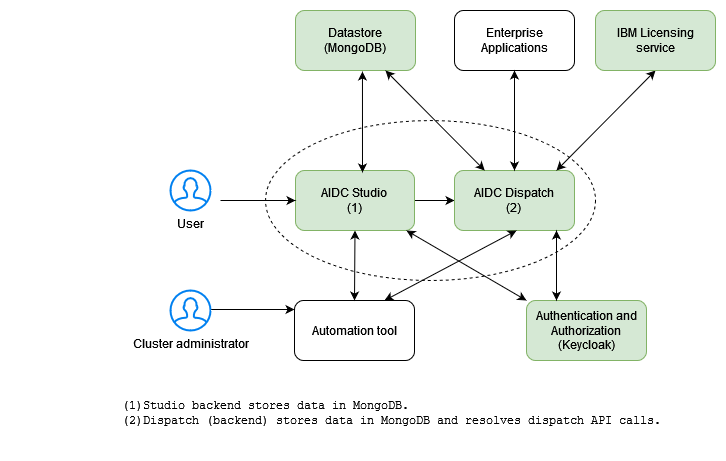
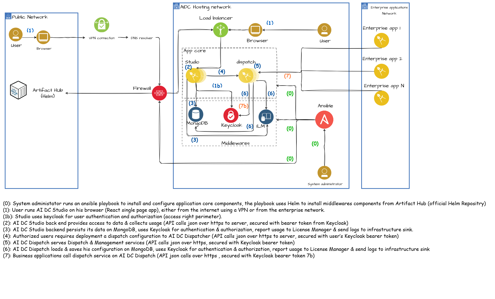
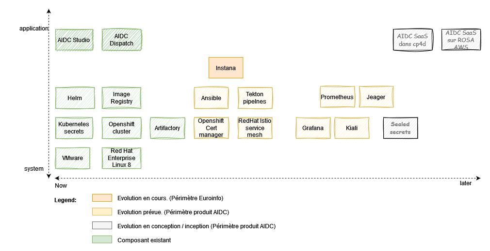
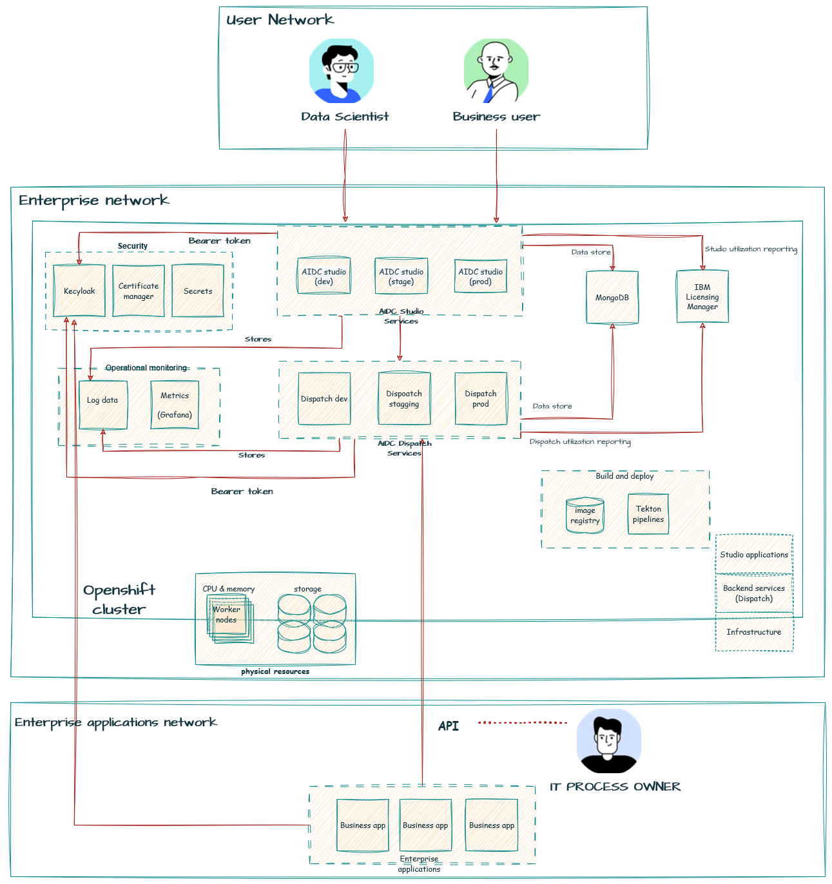
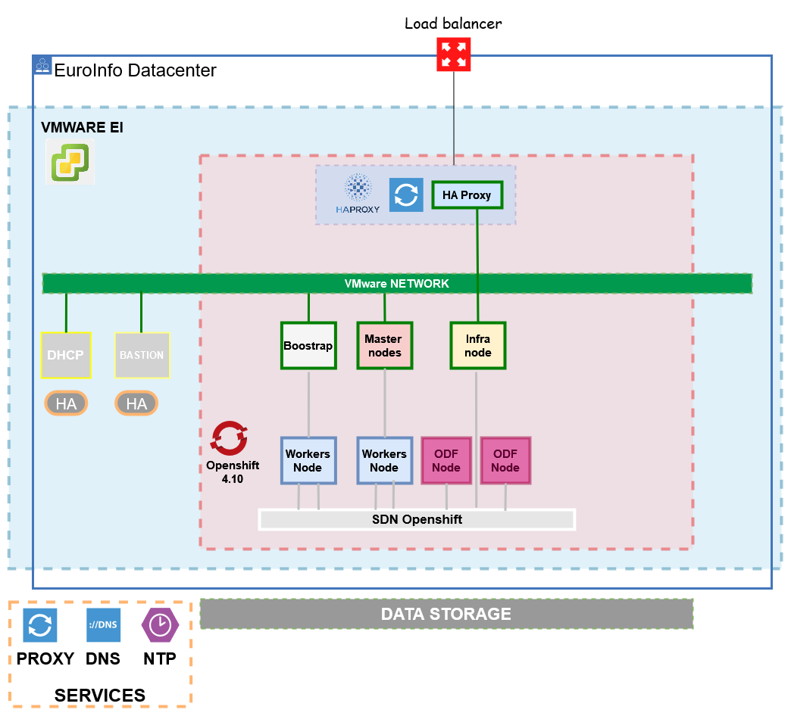
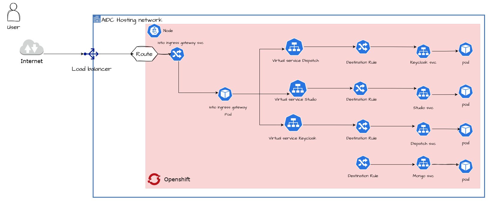

# Architecture

## System context

## Architecture Overview

## Components model

## Logical operational model

## Physical operational model

## Application Architecture

## Functionnal requirements

1. As a data scientist, I want to objectively demonstrate when my AI model will be more efficient than a human decision.
2. As an IT process owner, I want to have the ability to integrate my applications with AIDC, in order to analyse AI's role about a decision to make.
3. As a business owner, I want to objectively demonstrate when humans will be more efficient than AI to take business decisions.

## Non-Functionnal requirements

1. All AIDC services traffic inside the cluster have to be encrypted using mTLS (Mutual TLS).
2. All traffic at the cluster edge have to be encrypted (https)
3. Data store has to be highly-available
4. Automate all AIDC core application's components and middlewares
5. Manage the authentication and authorization using the OIDC workflow.
6. Report AIDC utilization metrics using IBM licensing Manager.
7. Software versions: Openshift 4.10+, MongoDB 5.0.8 (5.0.x), Keycloak (+v19 or more), ILM 3.21 (latest)

## Architectural decisions

1. Use Helm as the Kubernetes package manager for middlewares (Keycloak and MongoDB).
2. Use of Bitnami distribution for Helm charts (Keycloak and MongoDB).
3. Use Ansible to automate the installation and configuration of AIDC software components (core application + middlewares).
4. Keycloak for authentication and authorization management.
5. Implement Istio to ensure seemless mTLS traffic encryption without generating signing and rotating TLS certificates, neither changing application code to support it.
6. Implement Istio using the Redhat Istio Service mesh operator.
7. One Istio ingress gateway for every service exposed to the outside world, because in Openshift, to expose a service you create a route, and for every istio ingress gateway there is an automatically created route by Openshift.
8. Configure rate limiting for ingress traffic, in order to protect dispatch service exposed via API.
9. Expose the Istio ingress getway with an Openshift route.
10. For API Calls to dispatch service by enteprise apps, the user has to include mannualy the JWT in the request header. (no OIDC workflow)
11. For studio authentication process, implement an OIDC workflow with keycloak as Identity provider. (approach 3 - see security section)
12. mTLS inside the mesh will be handled by Citadel (Istio control plan component), in fact, it will generate, sign, and rotate the certificates used for traffic encryption.

## Viability assessment

1. The project has been realised with Openshift on IBM Cloud, it needs to be tested with Euroinfo team on their onpremise infrastructure. (VMWare)
2. At the Openshift route level, self-singed TLS cerificate has been used, it should be replaced with Euroinfo owned certificates.
3. mTLS inside the mesh was done using Citadel generated and rotated certificates, it should be tested integrating EuroInfo owned certificates.