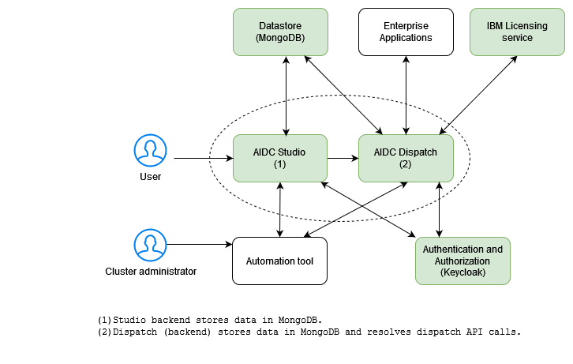
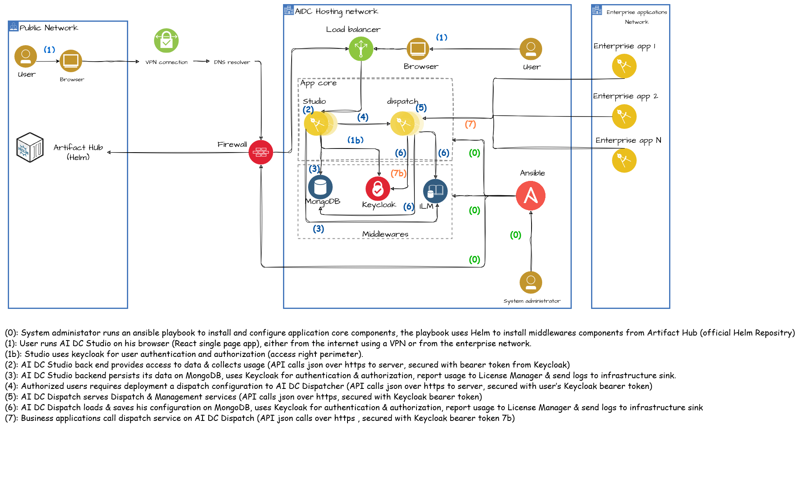
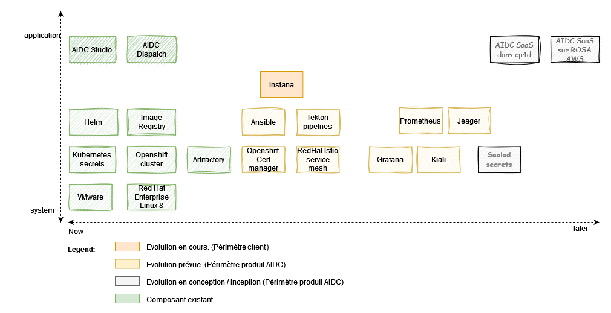
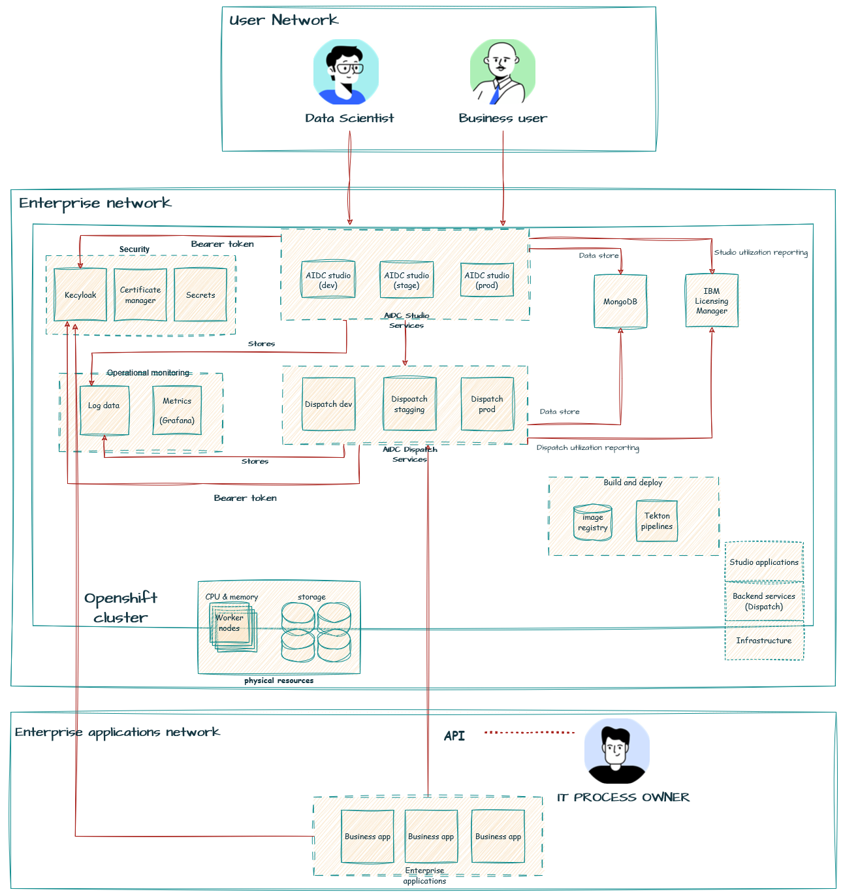
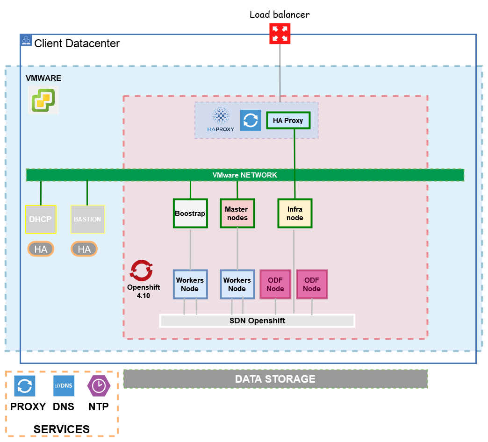
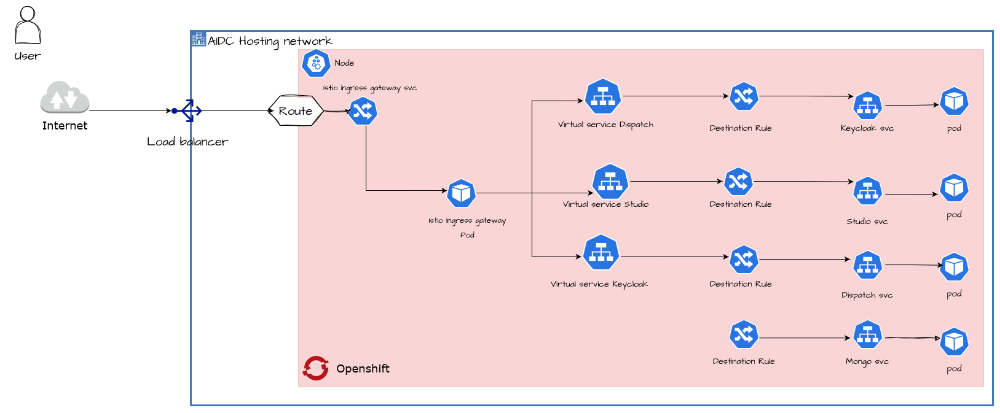

# Architecture

This section documents the target architecture I designed for deploying the AIDC platform on OpenShift, within the security constraints of a major French bank. It follows the IBM architecture method: from system context down to the physical operational model, then the requirements and the decisions that shaped the design.

## System context

How the platform fits in its environment: users, enterprise applications, the datastore, identity management, and license reporting.

## Architecture overview

End-to-end view of the solution: users reach the platform through the bank's network, traffic enters the cluster through a load balancer and the Istio ingress layer, and the core applications (Studio and Dispatch) talk to their middlewares inside the mesh.

## Components model

The components in scope, their maturity, and who owns each evolution (client scope vs. product scope).

## Logical operational model

## Physical operational model

The on-premise target: an OpenShift 4.10 cluster running on the client's VMware datacenter, fronted by a highly available HAProxy load balancer.

## Application architecture

How a request flows inside the mesh: OpenShift route → Istio ingress gateway → virtual services → destination rules → application services.

## Functional requirements

1. As a data scientist, I want to objectively demonstrate when my AI model will be more efficient than a human decision.
2. As an IT process owner, I want to integrate my applications with AIDC, in order to analyze AI's role in a decision to make.
3. As a business owner, I want to objectively demonstrate when humans will be more efficient than AI at taking business decisions.

## Non-functional requirements

1. All service-to-service traffic inside the cluster must be encrypted using mTLS (mutual TLS).
2. All traffic at the cluster edge must be encrypted (HTTPS).
3. The datastore must be highly available.
4. The installation of all core application components and middlewares must be automated.
5. Authentication and authorization must follow the OIDC workflow.
6. Product usage metrics must be reported through IBM License Manager.
7. Software versions: OpenShift 4.10+, MongoDB 5.0.x, Keycloak 19+, ILM 3.21 (latest).

## Architectural decisions

1. Use **Helm** as the Kubernetes package manager for the middlewares (Keycloak and MongoDB).
2. Use the **Bitnami distribution** of the Helm charts (Keycloak and MongoDB).
3. Use **Ansible** to automate the installation and configuration of all software components (core application + middlewares).
4. Use **Keycloak** for authentication and authorization management.
5. Implement **Istio** to provide seamless mTLS traffic encryption — no TLS certificate generation, signing, or rotation to operate, and no application code changes.
6. Install Istio through the **Red Hat OpenShift Service Mesh operator**.
7. Dedicate **one Istio ingress gateway per externally exposed service**: on OpenShift, each ingress gateway gets an automatically created route, which keeps the exposure model simple and auditable.
8. Configure **rate limiting** on ingress traffic to protect the Dispatch service exposed as an API.
9. Expose the Istio ingress gateways with **OpenShift routes**.
10. For API calls to the Dispatch service from enterprise applications, the caller includes the **JWT directly in the request header** (no interactive OIDC workflow).
11. For the Studio authentication, implement a **full OIDC workflow** with Keycloak as identity provider (see the [OAuth at the edge of the mesh](oauth_jwt.md) section, approach 3).
12. mTLS inside the mesh is handled by **Citadel** (the Istio control-plane CA): it generates, signs, and rotates the certificates used for traffic encryption.

## Viability assessment

1. The pilot was built on OpenShift on IBM Cloud; the next step was validating it with the client's infrastructure team on their on-premise VMware platform.
2. At the OpenShift route level, self-signed TLS certificates were used for the pilot; they are to be replaced with the client's own certificates in production.
3. mTLS inside the mesh used Citadel-generated and -rotated certificates; integrating the client's own certificate authority was identified as a follow-up validation.
