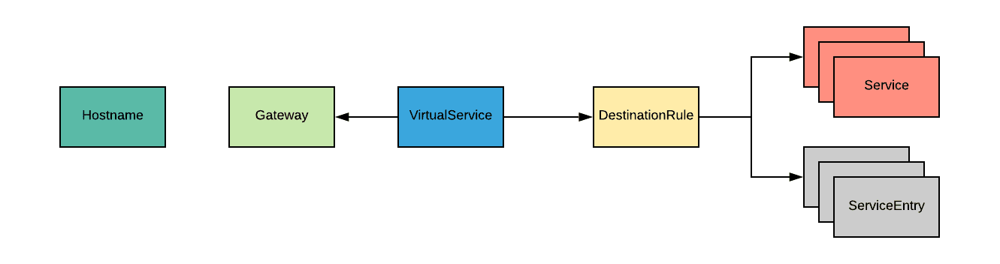
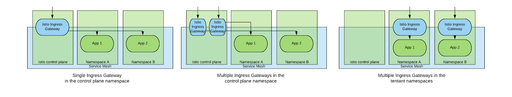
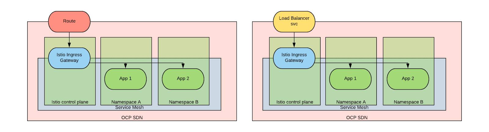
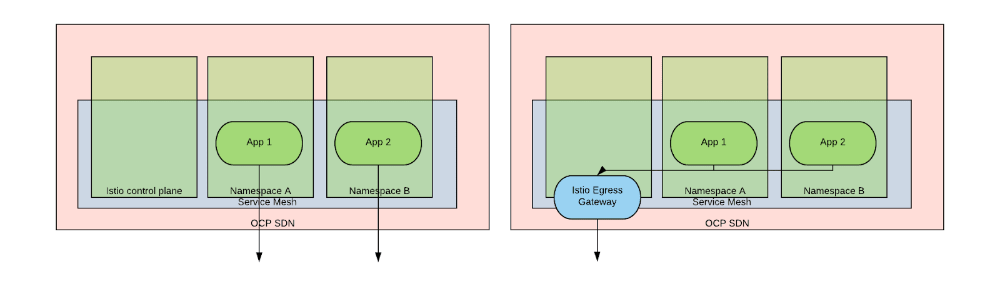
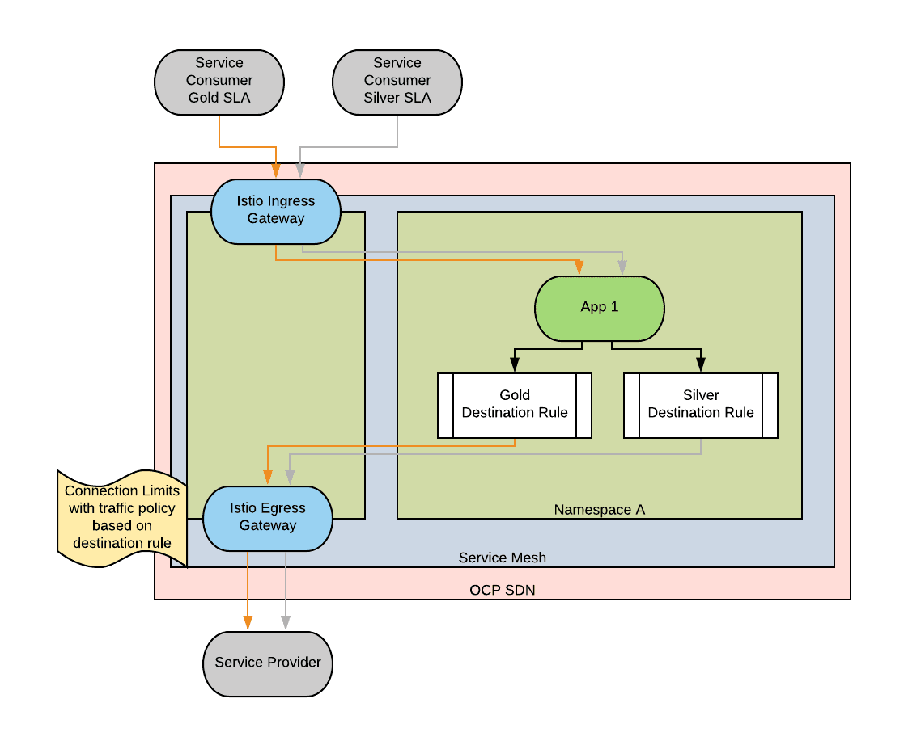

# Design considerations at the edge of the servicemesh

In my experience of implementing Red Hat ServiceMesh, I found that the mesh behaves like a special zone within an enterprise network. Inside of it, configurations are clear and strictly enforced. We have no control on what is outside of it, and we should assume that there can be anything.

Perhaps unexpectedly, we noticed that most of the time was spent around designing the edge of the mesh. The edge of the mesh is where coexistence with the external world needs to be configured.

## General Considerations on Inbound and Outbound Traffic

To better understand the next paragraphs, it’s useful to recall how traffic routing decisions are made in Istio (the model that we are about to present works well for HTTP traffic). Consider the following diagram:

Moving from the left to the right:

1. When a connection hits a member of the mesh (let’s imagine an ingress gateway, but it works the same for every member), all the routing decisions are made based on the hostname (host header field).
2. Ingress gateways are configured to listen for connections on certain ports and for certain hostnames based on Gateway objects. A gateway configuration selects the gateway pods to which it’s applied based on a label selector. Gateway objects should be defined in the same namespace where the gateway pods reside.
3. By default, ingress gateways are not aware of the services in the mesh. To make an ingress gateway aware of a service in the mesh, a VirtualService must be defined and applied to the gateway object. When the VirtualService is not in the same namespace as the gateway object, which should be the case in most situations, the gateway object should be referenced in NamespacedName format ("namespace"/"gateway").
4. A VirtualService may be coupled with a DestinationRule for fine-grained traffic management.
5. A VirtualService will then route to an active member of a Kubernetes service (auto discovered) or to a ServiceEntry. ServiceEntries ([here](https://github.com/trevorbox/service-mesh-patterns/blob/master/mongo-gateway-configuration/templates/serviceentry-mongodb.yaml) is an example) provide the ability to manually define endpoints that cannot be auto-discovered and may represent destinations outside of the mesh (location: MESH_EXTERNAL).

## Designing Ingress Traffic

For inbound traffic, it’s generally a good practice to drive traffic through one or more ingress gateways before letting it hit the services.

When designing how to deploy the ingress gateways of a service mesh, two main considerations are needed:

1. How many ingress gateways are needed?
2. What is the relationship between the ingress gateways and OpenShift routers?

*First consideration*:
One ingress gateway per mesh (OpenShift ServiceMesh supports multiple service meshes deployed in a single OpenShift instance) should be enough in most cases.

However, you might have scenarios in which additional gateways are needed. Scenarios include when two radically different configurations need to be supported or when two kinds of traffic need to be kept physically separated (here is an example of this configuration). Another instance when you might have more than one ingress gateway is when ingress gateways need to be owned by individual tenants within their namespace.

The below diagram captures three ingress gateway deployment patterns:

The last configuration setup is not currently supported by the OpenShift Service Mesh operator and requires manual setup by tenants.

The other important decision is whether to expose the ingress gateway mediated by an OpenShift router or directly exposed to external traffic via LoadBalancer service.

In this diagram, we can see two scenarios, one with the OpenShift router an ingress gateway chained together and one with the ingress gateway directly exposed.

Conceptually, the router is the entry point for traffic to enter into the OpenShift SDN and the Service Mesh ingress gateway is for traffic to enter into the mesh. The chaining of both the router and ingress gateway may introduce too many hops and may add latency to service calls.

- Scenario 1: more appropriate when the traffic is HTTP(s) or SNI+TLS, as this is the type of traffic supported by the router and when the added latency is not an issue.
- Scenario 2: more appropriate in situations where the traffic is of a type not supported natively by the router or it’s important to have good latency performance. In these scenarios, the mesh administrator needs to configure the LoadBalancer service along with the proper DNS records.

## Enforcing Ingress Traffic

The above considerations help to design the shape of our ingress traffic, but we might also want to enforce that the ingress pathways we have created are the only form of allowable traffic.

 NetworkPolicy is the right tool for the job at hand (a good, but not 100% accurate, mental model is to think of NetworkPolicies as ways to enforce traffic rules at layer 4 and Istio configurations as ways of enforcing traffic rules at layer 7).

There does not seem to be a way to configure the service mesh control plane to disallow traffic from the router (Feature request: https://github.com/maistra/istio/issues/127).

We can still enforce that traffic only originates from the Service Mesh by removing the permission to create routes via RBAC. We will also need to make sure that tenants cannot change the created network policies (again via RBAC).

## Designing Egress Traffic

For egress traffic, we, again, have to decide how many egress gateways we need. In some cases, the answer could be zero. However, in most cases, having one egress gateway will be useful:

Outbound traffic from a pod in the mesh always traverses through the envoy gateway, so there is a level of control on that traffic, even if it doesn’t flow through an egress gateway.

However, egress gateways can be used to achieve the following:

- TLS origination : We can use the egress gateway to terminate the TLS connections from the service mesh internal PKI and initiate new connections using the certificate from the external PKI. This allows for two PKI domains to coexist.
- Using a known egress IP : If outbound connections from services in a mesh need to originate from a known IP so that firewall rules can be applied, an option is to have all outbound connections diverted to an egress gateway and then to define an egress IP on the namespace where the egress-gateway is defined.
- Organization might have requirements by which all outbound traffic needs to originate from a specific set of nodes.

## Enforcing Egress Traffic

[EgressNetworkPolicies](https://docs.openshift.com/container-platform/4.12/networking/openshift_sdn/editing-egress-firewall.html): enforce that no traffic leaves the cluster except from the namespace where the egress gateways are deployed.

We can also enforce that traffic leaving the mesh pods stays in the mesh using [network policies](https://kubernetes.io/docs/concepts/services-networking/network-policies/) with egress rules (again, we need to guarantee that the users cannot manage network policies).

Additionally, Istio can be configured to forbid the routing of addresses unknown to the mesh.

Normally, if an application attempts to open a connection to an address that is unknown to the mesh, Istio would use DNS to resolve the address and execute the request. With the global.outboundTrafficPolicy mode option set to [REGISTRY_ONLY](https://istio.io/latest/docs/reference/config/istio.mesh.v1alpha1/#MeshConfig-OutboundTrafficPolicy-Mode), we can configure Istio to only allow connections to known addresses (that is, addresses for which a VirtualService is defined).

## Configuring Rate Limiting for Edge Traffic/Circuit breaker

In certain scenarios, it might be necessary to rate limit the outbound traffic from the mesh. These types of traffic controls are useful when an upstream service may have imposed limits based on pricing tier, or legacy systems that may only be able to handle a certain amount of requests or concurrent connections over a period of time.

Furthermore, different SLAs might be applied for traffic originating from different sources and creating a need to rate limit these traffic types in different ways.

Destination rules and traffic policies can be used in conjunction with circuit breakers to manage how inbound requests of different SLAs can be prioritized when propagating out of the mesh.

In the above diagram, we demonstrate how two different inbound requests that are assigned different SLA classes (one such way can be assigning a header) can be used to apply different destination rules and corresponding traffic policies ([here](https://github.com/cloudfirst-dev/istio-egress-traffic-control) is an example). These methods can be used to maintain a healthy upstream system and allow for the services in the mesh to continue functioning or apply circuit breakers patterns when the limits are reached.