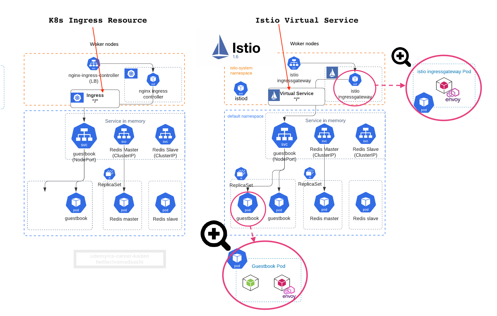
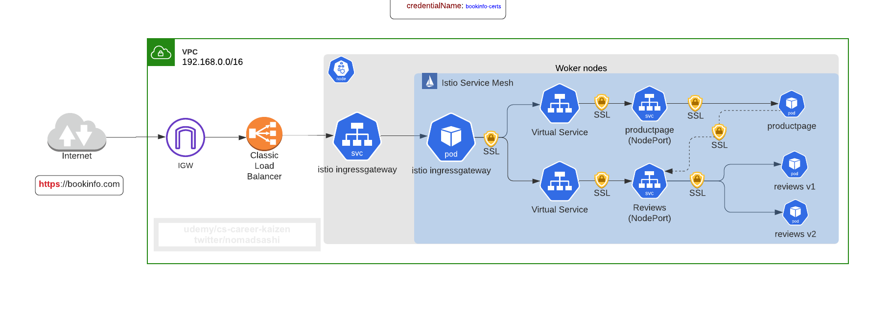

# 1. Intro

## What is Service Mesh
Ref: https://istio.io/docs/concepts/what-is-istio/#what-is-a-service-mesh

__Istio Service Mesh__ is a network connectivity (i.e. __mesh__) within Kubernetes cluster created by __Envoy proxy__ containers, be it a standalone or a sidecar proxy:

Another huge benefit of Istio is the default in-cluster __mutual TLS__.

Without istio, say if using __Ingress controller__, you can configure __TLS termnation__ at ingress controller pod, like this:

With __istio__, __connections among pods__ in the cluster behind the what-used-to-be ingress controller (i.e. Istio Gateway) can be __mutual TLS__, without changing app code:
