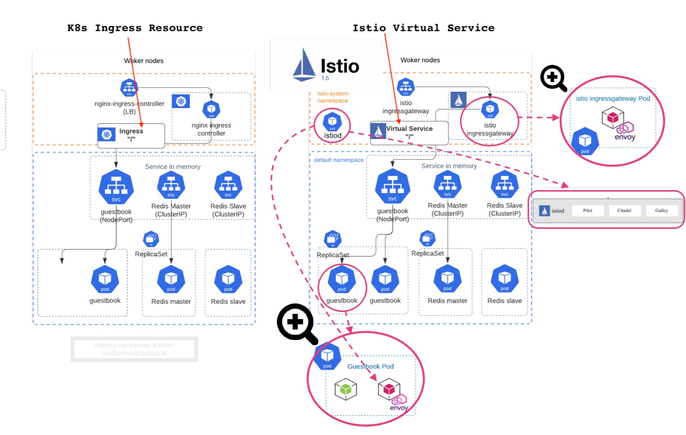

# 1. Istio Architecture

## Istio Service Mesh Architecture
Ref: https://istio.io/latest/docs/ops/deployment/architecture/

## Brief Architectural Summary of Istio

- service-mesh implementations comes with a __control plane__(istiod) and a __data plane__(a standalone edge Envoy proxy and sidecar Envoy proxies)
- __data plane__ is composed of a set of intelligent proxies (__Envoy__) deployed as sidecars.  These proxies mediate and control all network communication between microservices. They also collect and report telemetry on all mesh traffic.
- __control plane__ lives outside of the request path and is used to administer and control the behavior of the data plane

### Data plane
- __Envoy proxy__: a high-performance proxy developed in C++ to mediate all inbound and outbound traffic for all services in the service mesh. Envoy proxies are the only Istio components that interact with data plane traffic.
- Traffic control 
    - a different load balancing policy to traffic for a particular subset of service instances
    - Staged rollouts with %-based traffic split
    - HTTP/2 and gRPC proxies
    - Istio Resources
        - Virtual services
        - Destination rules
        - Gateways
        - Service entries
        - Sidecars
- Network resiliency
    - Fault injection
    - Retries
    - Circuit breakers
    - Failovers
    - Health checks
- Security and Authentication
    - Rate limiting
    - TLS termination

### Control Plane
- __Istiod__ (consists of __pilot, galley, and citadel__)
    - Dynamic service discovery: in order to direct traffic within your mesh, Istio needs to know where all your endpoints are
    - Strong service-to-service and end-user authentication with built-in identity and credential management
    - Pilot - the core data-plane config (xDS) server
    - Galley - configuration watching, validation, forwarding
    - Citadel - certificate signing, secret generation, integration with CAs, etc
    - Telemetry - a “mixer” component responsible for aggregating and syndicating telemetry to various backends
    - Policy - a request-path “mixer” component responsible for enforcing policy

## Architecture change from before and after v1.5
### _Before Istio 1.5_

### _After Istio 1.5_

Reduced installation and configuration complexity by moving control plane components into a single component: __Istiod__. This binary includes the features of __Pilot, Citadel, Galley, and the sidecar injector__ (microservices turned into a monolith in favor of easier management)

