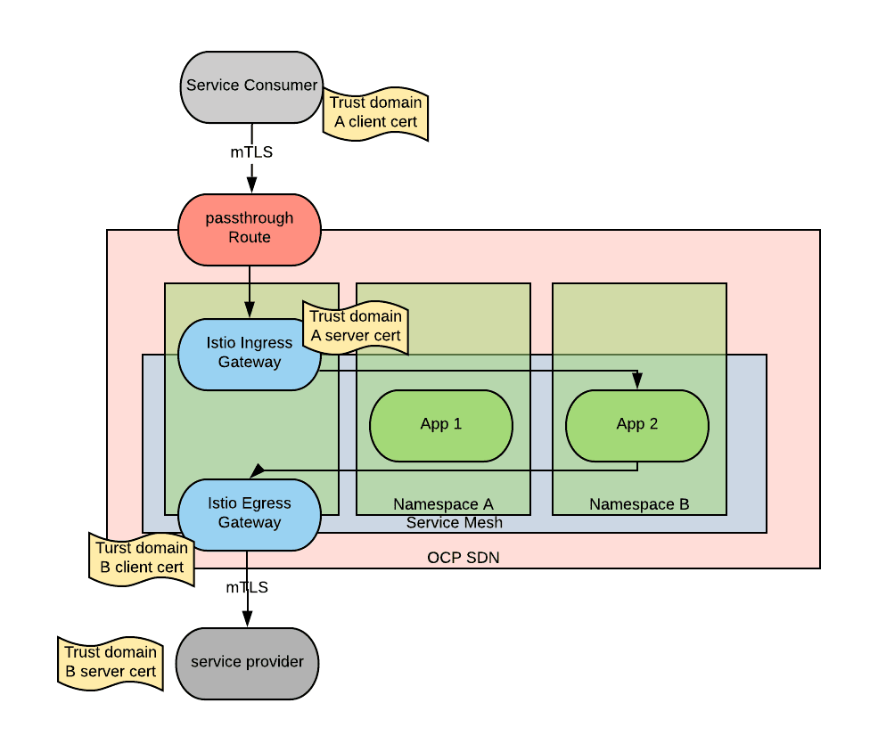

## Configuring TLS and mTLS for Edge Traffic

Ingress and egress gateways can be useful to configure how TLS connections should be handled between different PKI trust domains. Istio manages its own PKI by default with an internal trust domain and it is safe to assume that outside of the mesh there are other trust domains.

The following is a diagram capturing this scenario:

In the diagram above, we can see that the application consuming the service within the service mesh is in the trust domain A. In this case, mTLS has been configured between the consumer and the ingress gateway (here are instructions on how this is accomplished). Then, the application makes an outbound call to an external service, which belongs to trust domain B. mTLS is configured by deploying the correct certificates on the egress gateway (here are instructions on this portion).

By managing the certificates at the gateway level, we achieve the following:

- Easier configuration: There is not an easy way to deploy an additional certificate to a sidecar, but it is relatively easy to add certificate material to the gateways.
- Centralized configuration: The certificate configuration can be reused by all the services in the mesh.

Naturally, we could have set up a normal TLS deployment by deploying CA bundles instead of client certs, this decision does not impact the service mesh tenants.

These kinds of setups are highly simplified if there is a mechanism to automatically provision certificates. The Cert-manager operator is an ideal option in this space.