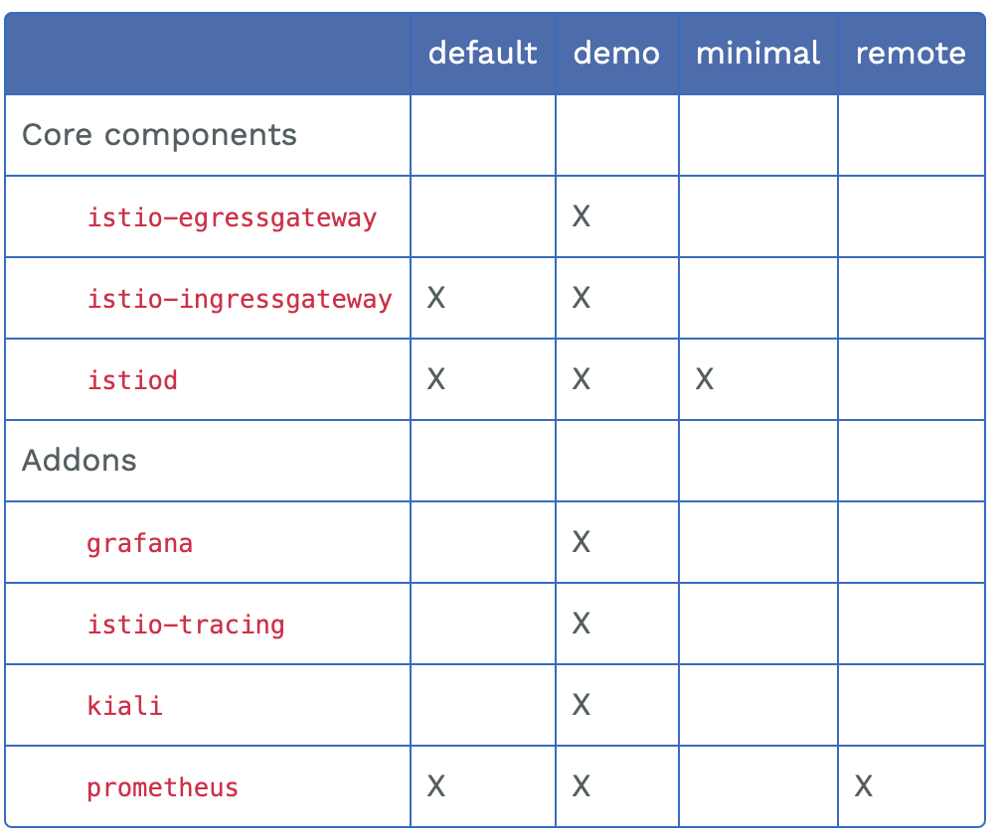
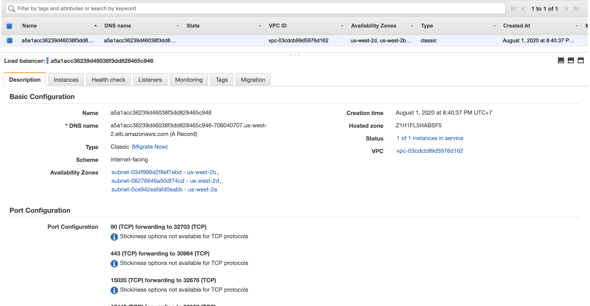

# Istio service mesh installation

## Using RedHat Istio service mesh operator on Openshift

### Installing operators

You must install all operators from redhat, otherwise, there is no redhat support, and it will install an old Istio version without you KNOWING IT (for me it was v1.4.11), and the latest version is at the time writing this : 1.12.

Install the following operators in this in order:

1. ElasticSearch (from Redhat)
   Update channel: stable.
   Installation mode: default.
   (namespace: openshift-operators-redhat).
   Update approval: automatic.
2. Jaeger - Red Hat OpenShift distributed tracing platform (from redhat)
   Installation mode: default.
   (namespace: openshift-distributed-tracing).
   Update approval: automatic.
3. Kiali (from redhat).
   Update channel: stable.
   Installation mode: default.
   (namespace: openshift-operators).
   Update approval: automatic.
4. Redhat service mesh operator. (redhat)
   Update channel: stable.
   Installation mode: default.
   (namespace: openshift-operators).
   Update approval: automatic.

You can choose between automatic and manual update approval. (automatic for demo purposes)

Variable setting:
```sh
# namespace to add into the service mesh
$ export OCP_NS=myservicemesh-namespace
```

Check that the operators involved in the Service Mesh installation are installed properly:

```sh
$ oc get subscription -n openshift-operators
```

Check the installation with the ClusterServiceVersion custom resource:

```sh
$ oc get ClusterServiceVersion
```

Create a namespace called istio-system where the Service Mesh control plane will be installed:

```sh
cd Istio
cat servicemesh-namespace.yml
$ oc apply -f servicemesh-namespace.yml
```

Create a service mesh controle plane and service member roll in the istio-system namespace and add your namespace into the istio control plane:

```sh
cat istio/basic-istio-install.yml | NAMESPACE=$OCP_NS envsubst | oc apply -f -
```

Run the following command to verify the ServiceMeshContolPlane & ServiceMeshMemberRoll was created successfully:

```sh
oc get smmr -n istio-system default
watch -n 0.2 oc get smcp -n istio-system basic
#it will take few minutes
```

### Adding workloads into the mesh

```sh
$ oc edit smmr -n <controlplane-namespace>
```

Modify the SMMR YAML to add or remove projects as members.
You can add any number of projects, but a project can only belong to one ServiceMeshMemberRoll resource.

### Enabling sideCar autoInjection

SideCar autoInjection can be enabled using annotation at the your application deployment level:

First of all, let's check our deployment annotations:

```sh
$ oc get deployment -n my-deployment -o yaml
```

You must add the following annotation `sidecar.istio.io/inject: 'true'` fllowing this path: `spec > template > metadata > annotations`.

```sh
# example:
annotations: sidecar.istio.io/inject: 'true'
```

You can do it at the statefulset level also, it's not recommended at the pod level (because of versatility).

## Using Istio upstream (K8s)

### Install Istio using istioctl

```sh
# first install istioctl CLI
curl -L https://istio.io/downloadIstio | ISTIO_VERSION=1.6.6 sh -
cd istio-1.6.6
echo "export PATH=$PWD/bin:$PATH" >> ~/.bash_profile

# open new shell to load updated PATH variable
```

### Install Istio to K8s cluster using istio config profile

Ref: https://istio.io/latest/docs/setup/additional-setup/config-profiles/

There are a few preset profiles we can install:

- default
- demo
- minimal
- etc



I recommend to install `demo` profile, which comes with ingress/egress gateways, as well as grafana, kiali, jaegger (request tracing), and prometheus monitoring/metrics dashboards.

```sh
# display the list of available profiles
istioctl profile list

# save config into yaml
istioctl profile dump demo > profile_demo_config.yaml
```

Output
```sh
apiVersion: install.istio.io/v1alpha1
kind: IstioOperator
spec:
  addonComponents:
    grafana:
      enabled: true
      k8s:
        replicaCount: 1
    istiocoredns:
      enabled: false
    kiali:
      enabled: true
      k8s:
        replicaCount: 1
    prometheus:
      enabled: true
      k8s:
        replicaCount: 1
    tracing:
      enabled: true
  components:
    base:
      enabled: true
    citadel:
      enabled: false
      k8s:
        strategy:
          rollingUpdate:
            maxSurge: 100%
            maxUnavailable: 25%
    cni:
      enabled: false
    egressGateways:
    - enabled: true
      k8s:
        resources:
          requests:
            cpu: 10m
            memory: 40Mi
      name: istio-egressgateway
```

```sh
# generate a k8s manifest for profile "demo" before installation
istioctl manifest generate \
  --set profile=demo \
  --set values.gateways.istio-ingressgateway.sds.enabled=true \
  > generated-manifest-demo.yaml
```

Install/update istio (won't work on v1.6)

~~kubectl apply -f generated-manifest-demo.yaml~~
```sh
# note: "istioctl manifest apply" works for both v1.5 and v1.6, but will be deprecated from v1.7 in favor of istioctl install
<!-- istioctl manifest apply \
  --set profile=demo \
  --set values.gateways.istio-ingressgateway.sds.enabled=true  -->

# use "istioctl install" instead
istioctl install --set profile=demo
```

Output
<details><summary>show</summary><p>

```sh
✔ Istio core installed                                                                          ✔ Istiod installed  
✔ Ingress gateways installed
✔ Egress gateways installed                                                                     ✔ Addons installed                                                                              ✔ Installation complete
```
</p></details>


Analyze and detect potential issues with your Istio configuration
```sh
istioctl analyze --all-namespaces

# output
Warn [IST0102] (Namespace default) The namespace is not enabled for Istio injection. Run 'kubectl label namespace default istio-injection=enabled' to enable it, or 'kubectl label namespace default istio-injection=disabled' to explicitly mark it as not needing injection
Warn [IST0102] (Namespace kube-node-lease) The namespace is not enabled for Istio injection. Run 'kubectl label namespace kube-node-lease istio-injection=enabled' to enable it, or 'kubectl label namespace kube-node-lease istio-injection=disabled' to explicitly mark it as not needing injection
Error: Analyzers found issues when analyzing all namespaces.
See https://istio.io/docs/reference/config/analysis for more information about causes and resolutions.
```

Show objects created
```sh
kubectl get pod,svc -n istio-system

# output
NAME                                        READY   STATUS    RESTARTS   AGE
pod/grafana-5cc7f86765-krwvf                1/1     Running   0          5m51s
pod/istio-egressgateway-5c8f9897f7-sfqg6    1/1     Running   0          29m
pod/istio-ingressgateway-65dd885d75-bbqtn   1/1     Running   0          29m
pod/istio-tracing-8584b4d7f9-whwjr          1/1     Running   0          5m39s
pod/istiod-7d6dff85dd-w5szx                 1/1     Running   0          29m
pod/kiali-696bb665-sngrt                    1/1     Running   0          5m43s
pod/prometheus-564768879c-w55nb             2/2     Running   0          5m39s

NAME                                TYPE           CLUSTER-IP       EXTERNAL-IP                                                              PORT(S)                                                                                                                                      AGE
service/grafana                     ClusterIP      172.20.151.105   <none>                                                                   3000/TCP                                                                                                                                     5m50s
service/istio-egressgateway         ClusterIP      172.20.208.92    <none>                                                                   80/TCP,443/TCP,15443/TCP                                                                                                                     29m
service/istio-ingressgateway        LoadBalancer   172.20.170.225   aa7cfd0021476452ba8c3836365f2df3-478100139.us-east-1.elb.amazonaws.com   15020:31474/TCP,80:30046/TCP,443:31013/TCP,15029:31841/TCP,15030:31961/TCP,15031:30599/TCP,15032:30637/TCP,31400:31608/TCP,15443:32324/TCP   29m
service/istio-pilot                 ClusterIP      172.20.97.20     <none>                                                                   15010/TCP,15011/TCP,15012/TCP,8080/TCP,15014/TCP,443/TCP                                                                                     29m
service/istiod                      ClusterIP      172.20.236.155   <none>                                                                   15012/TCP,443/TCP                                                                                                                            29m
service/jaeger-agent                ClusterIP      None             <none>                                                                   5775/UDP,6831/UDP,6832/UDP                                                                                                                   5m35s
service/jaeger-collector            ClusterIP      172.20.177.164   <none>                                                                   14267/TCP,14268/TCP,14250/TCP                                                                                                                5m37s
service/jaeger-collector-headless   ClusterIP      None             <none>                                                                   14250/TCP                                                                                                                                    5m36s
service/jaeger-query                ClusterIP      172.20.116.249   <none>                                                                   16686/TCP                                                                                                                                    5m38s
service/kiali                       ClusterIP      172.20.253.248   <none>                                                                   20001/TCP                                                                                                                                    5m45s
service/prometheus                  ClusterIP      172.20.101.184   <none>                                                                   9090/TCP                                                                                                                                     5m41s
service/tracing                     ClusterIP      172.20.143.171   <none>                                                                   80/TCP                                                                                                                                       5m33s
service/zipkin                      ClusterIP      172.20.170.147   <none>                                                                   9411/TCP                                          
```


In cas you're using AWS as a cloud provider, you should notice that the service `istio-ingressgateway` in `istio-system` namespace created AWS ELB of type classic load balancer
```
service/istio-ingressgateway        LoadBalancer   10.100.229.231   a5a1acc36239d46038f3dd828465c946-706040707.us-west-2.elb.amazonaws.com   15020:32676/TCP,80:32703/TCP,443:30964/TCP,31400:30057/TCP,15443:32059/TCP   15m
```

Using AWS console, check AWS ELB created by istio ingress gateway service:




Also notice a pod `istiod-7d6dff85dd-w5szx`.
This is the pod that contains istio pilot (service discovery), Galley (config), sidecar injector, that is `istiod`.
> istiod unifies functionality that Pilot, Galley, Citadel and the sidecar injector previously performed, into a single binary

### Enable Istio Sidecar Injection

Add a namespace label to instruct Istio to automatically inject Envoy sidecar proxies when you deploy your application later
```sh
# first describe default namespace
kubectl describe ns default

# output
Name:         default
Labels:       <none>
Annotations:  <none>
Status:       Active
No resource quota.
No resource limits.

# enable istio sidecar injection by adding a label
kubectl label namespace default istio-injection=enabled

# verify label is added
# output
Name:         default
Labels:       istio-injection=enabled
Annotations:  <none>
Status:       Active
No resource quota.
No resource limits.

# to disable
kubectl label namespace default istio-injection-
```
