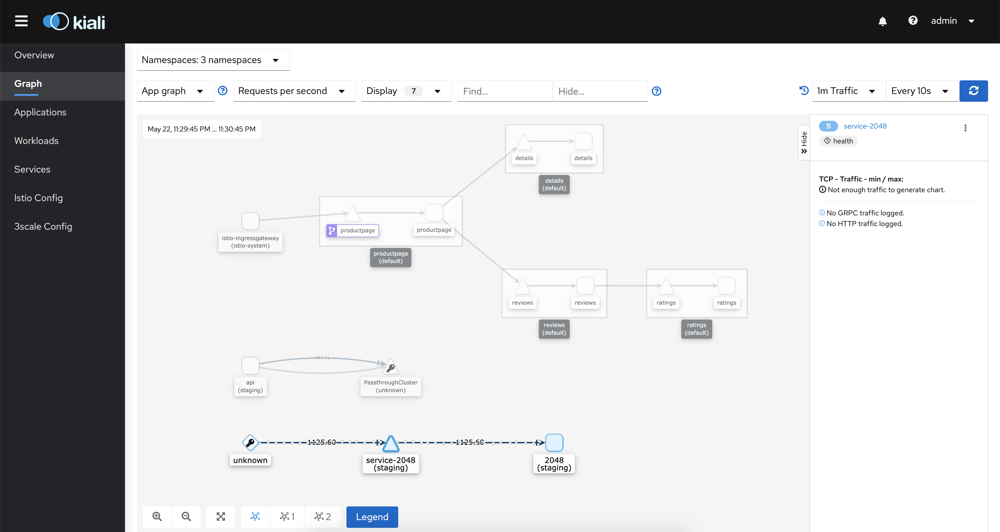

# Monitoring and Telemtry

When installing istio using vanilla flavour `demo` profile or the redhat istio service mesh 2.0 operator, it installed monitoring tools such as `grafana`, `prometheus`, `kiali`, `jaeger`. We will cover these a bit more in this section.

```sh
# list pods
kubectl get pod -n istio-system

# output
NAME                                    READY   STATUS    RESTARTS   AGE
grafana-74dc798895-5wwk8                1/1     Running   0          22m
istio-egressgateway-7c6c6cd8b9-c87lz    1/1     Running   0          22m
istio-ingressgateway-5d869f5bbf-bvpxs   1/1     Running   0          22m
istio-tracing-8584b4d7f9-7wmsw          1/1     Running   0          22m
istiod-648555b9b7-qgtg9                 1/1     Running   0          23m
kiali-6f457f5964-9dhh9                  1/1     Running   0          22m
prometheus-7fb8c98b68-h2rfp             2/2     Running   0          22m
```

## Check Grafana dashboard

Istio vanilla flavour On k8s:
```
istioctl dashboard grafana
```

Redhat Istio service mesh 2.0 On Openshift:
```
oc dashboard grafana
```

## Grafana Dashboard Walkthrough
Create kubernetes dashboard on grafana by:
+ icon > type `3119` dashboard ID > Select ‘Prometheus’ as the endpoint under prometheus data sources drop down.


In the web UI, you can see all the targets and metrics being monitored by grafana:


## Practically useful Grafana community dashboards 

- [K8 Cluster Detail Dashboard](https://grafana.com/grafana/dashboards/10856)
- [K8s Cluster Summary](https://grafana.com/grafana/dashboards/8685)
- [Kubernetes cluster monitoring](https://grafana.com/grafana/dashboards/315)


## Check Kiali Dashboard

Istio vanilla flavour on K8s:

```
istioctl dashboard kiali
```

Redhat Istio service mesh 2.0 On Openshift:
```
oc dashboard kiali
```

Username and password is `admin` by default.



Will walk through Kiali more in this section.