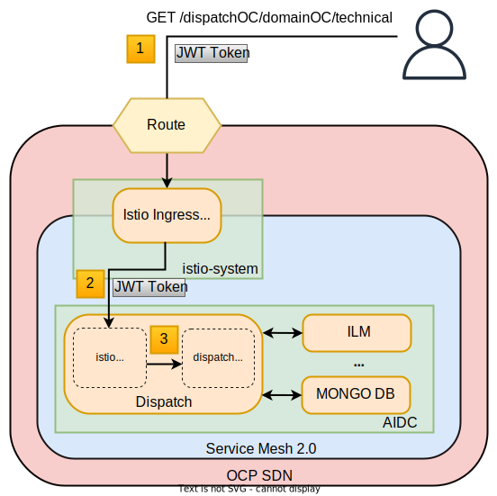
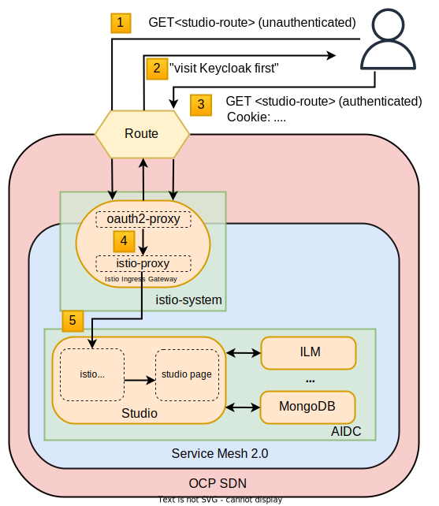
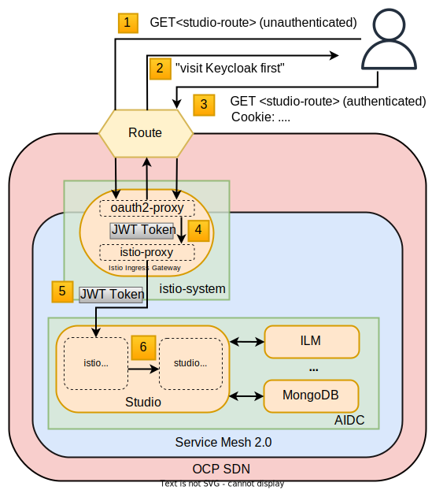

# Configuring OAuth Authentication for Edge Traffic

In this section, we go through these native authentication/authorization mechanisms, and explore a way to implement a full automated workflow based on OIDC. Keycloak is used as the authentication/authorization entity. All the code and more detailed READMEs for each approach are available in the corresponding subdirectories.

This section assumes a running OCP 4 cluster (>= 4.6) and cluster-admin user are available.

For the sake of simplicity, it is better to delete and re-create the istio control plane and the AIDC application when trying the different approaches below.

## Requirements

* Have an OCP 4.6 running cluster
* Have a user with cluster-admin role
* Have Service Mesh 2.0 installed
* Have a keycloak platform secured with non self-signed certificates
* if your keycloak is secured with self-signed certificates, you have to deploy keycloak on another physical server other than the one hosting the Openshift cluster
* Have the AIDC service mesh application deployed

## Approach 1: Using Istio native mechanisms for JWT-based authorization (used for dispatch access [Backend])

In this approach, access to the `AIDC` application is restricted using Istio-related CRD [RequestAuthentication](https://istio.io/latest/docs/reference/config/security/request_authentication/) and [AuthorizationPolicy](https://istio.io/latest/docs/reference/config/security/authorization-policy/) deployed in the cluster. A user can access the application by providing a JWT token in its HTTP request (through the HTTP Header `Authorization`).

The workflow is as follows:

0. the user authenticates to keycloak and get a JWT token (not shown in the above picture);
1. the user performs an HTTP request to `https://<dispatch-route>/dispatchOC/domainOC/technical` and passes along this request the JWT token;
2. the Istio ingress gateway (default one) forwards the request and the JWT token to the istio-proxy container of the dispatch pod;
3. the istio-proxy container of the dispatch pod checks the validity of the JWT token depending on the `RequestAuthentication` and `AuthorizationPolicy` objects deployed beforehand;
4. if the JWT token is valid, user accesses `/dispatchOC/domainOC/technical` - otherwise, an error message is returned to the user (code 404, message "RBAC denied" or others).

### Pros:
* the simplest approach (only 2 CR to be deployed)
* fine-grained authorization based on JWT token fields

### Cons:
* no OIDC workflow: the user must get a JWT token on its own, and pass it with the HTTP request on its own
* need to define `RequestAuthentication` and `AuthorizationPolicy` objects for each application to protect inside the service mesh

## Approach 2: Injecting oauth2-proxy container inside the Istio ingress gateway to implement an OIDC workflow (used for studio access [Frontend])

In this approach, access to the `AIDC` application is restricted by injecting an oauth2-proxy sidecar container to the Istio ingress gateway. The oauth2-proxy will enforce user authentication with Keycloak before forwarding any request to the istio-proxy (the default container of the Istio ingress gateway). In this approach, the OIDC workflow between the user, oauth2-proxy and Keycloak is perfomed automatically.

The workflow is as follows:

1. the user performs an unauthenticated HTTP request to `https://<studio-route>`;
2. the oauth2-proxy inside the Istio ingress gateway pod initiates the OIDC workflow to authenticate the user; user authenticates to keycloak (not shown on the picture);
3. the user performs an authenticated HTTP request to `https://<studio-route>`; the authentication is checked by the oauth2-proxy using HTTP cookies;
4. the oauth2-proxy forwards locally (same pod) the request to the istio-proxy container of the Istio ingress gateway, which in turn forwards the request to the istio-proxy container of the studio pod;
5. user accesses `<studio-route>`.

### Pros:
* authentication enforced at the ingress gateway level (no need to define `RequestAuthentication` and `AuthorizationPolicy` objects for each application)
* automated OIDC workflow to authenticate the user

### Cons:
* coarse-grained authorization (authenticated == authorized)
* complex setup (involve patches)

## Approach 3: Combining JWT-based authorization and OIDC workflow (Best of both approaches)

This approach combines the use of `RequestAuthentication` and `AuthorizationPolicy` objects as done for approach 1, and the injection of the oauth2-proxy container as done in the approach 2. In this approach, the oauth2-proxy container extracts the JWT token from the authentication cookie, and forwards it to the istio-proxy container alongside the HTTP request (using the `X-Forwarded-Access-Token` HTTP header). As a result, an automated OIDC workflow to authenticate the user is performed, and can be, if needed, combined to a fine-grained authorization based on JWT token fields (e.g. simple auth for 'non-secure' apps, auth + JWT field for more secure apps).

The workflow is as follows:

1. the user performs an unauthenticated HTTP request to `https://<studio-route>`;
2. the oauth2-proxy inside the Istio ingress gateway pod initiates the OIDC workflow to authenticate the user; user authenticates to keycloak (not shown on the picture);
3. the user performs an authenticated HTTP request to `https://<studio-route>`; the authentication is checked by the oauth2-proxy using HTTP cookies;
4. the oauth2-proxy extracts the JWT token from the authentication cookie and forwards it locally (same pod) alongside the HTTP request to the istio-proxy container of the Istio ingress gateway;
5. the istio-proxy container of the Istio ingress gateway forwards the request and the JWT token to the istio-proxy container of the studio pod;
6. the istio-proxy container of the studio pod checks the validity of the JWT token depending on the `RequestAuthentication` and `AuthorizationPolicy` objects deployed beforehand;
7. if the JWT token is valid, user accesses `<studio-route>` - otherwise, an error message is returned to the user (code 404, message "RBAC denied" or others).

### Pros:
* authentication enforced at the ingress gateway level
* automated OIDC workflow to authenticate the user
* if needed, fine-grained authorization based on JWT token fields

### Cons:
* complex setup (currently involves deployment / service / route patches)

Usefull information:

The request authentication is only making sure that when a JWT token is provided, it has to be a valid one. If there is no token, it will just pass through the request.

You could add more gateways to this service mesh deployment in case you need to handle unauthenticated traffic or traffic using a different authentication method.

Once the token is created via the authentication workflow, you can configure the ingress gateway to verify it. Additionally, you can configure all of the services in the mesh to re-verify the token, increasing your security. In order for this to work, your services need to forward the token at every step.

If you provide a token in the authorization header, its implicitly default location, Istio validates the token using the public key set, and rejects requests if the bearer token is invalid. However, requests without tokens are accepted.

# Reference
[Istio Authorization architecture](https://istio.io/latest/docs/concepts/security/#authorization)
