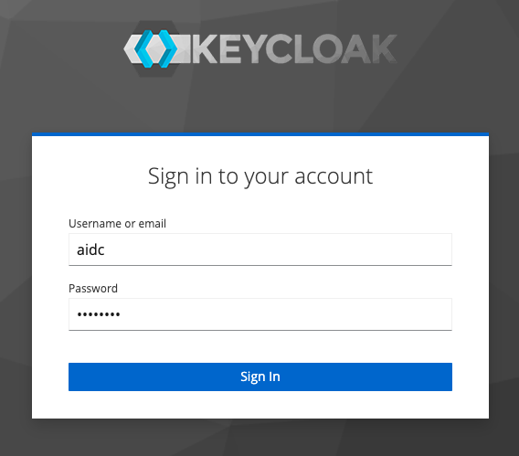
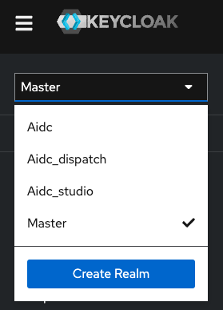
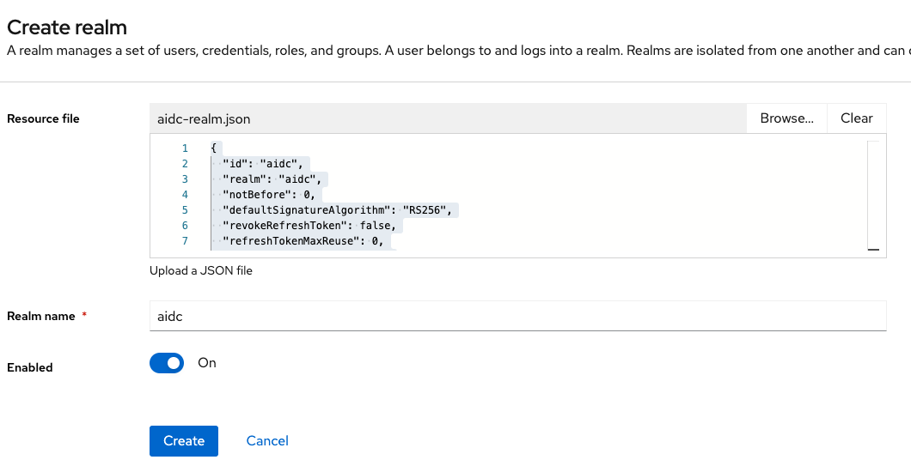
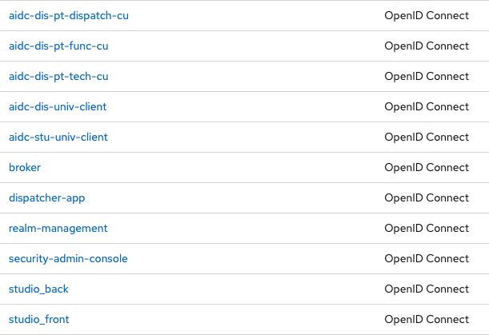
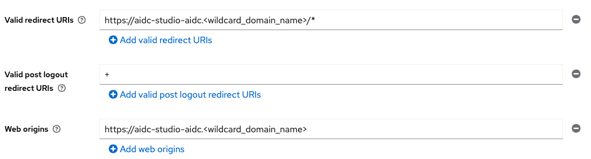
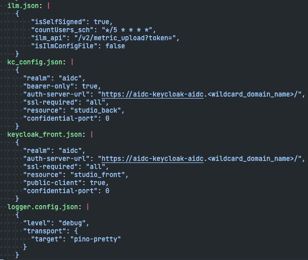

# IBM AI Decision Coordination install guide

## 1. Revision history

- 2022-12-08: The documentation has been released in the version `1.0.0`.

## 2. Getting started

This guide provides a step-by-step procedure for installing the product IBM AI Decision Coordination. Before starting the installation, you need to prepare the technical environment `workstation` or `server` from where the installation will be executing.

You need to have the two images contained in the aidc-studio-1.0.0.tar.gz & aidc-dispatch-1.0.0.tar.gz files loaded to a container registry accessible fro your target OpenShift environment. Other images obtainable through public repository might be needed depending on your installation specifics, they are listed below.

If you need a specific installation, you may contact the product team at AIDC-Contact@ibm.com.

### 2.1. Required tools

To be able to perform the next steps, you need to have the following tools:

| package name             | min. version required               |
| ------------------------ | ----------------------------------- |
| python3                  | > 3.10.x                            |
| Kubernetes (pip package) | = 25.3.0                            |
| libressl **OR** openssl  | > 3.3.x **OR** 3.0.x                |
| OpenShift-cli            | (depending on your cluster version) |
| ansible-core             | > 2.12.x                            |
| helm                     | > 3.10.x                            |

**Note**: `libressl` or `openssl` package is only required for generating self-signed certificates.

### 2.2. Resource requirements

To ensure that the product performs fine, here are our recommendations:

- Resources requests

| component name | min. cpu | min. memory | min. pods |
| -------------- | -------- | ---------- | ---- |
| aidc-studio | "500m" | "512Mi" | 2 |
| aidc-dispatch | "500m" | "512Mi" | 2 |

- Resources limits

| component name | max. cpu | max. memory | max. pods |
| -------------- | -------- | ---------- | ---- |
| aidc-studio | "2000m" | "4Gi" | 2 |
| aidc-dispatch | "4000m" | "16Gi" | 16 |

> **Note:** `aidc-studio ` should not need to be scaled beyond 2 PODs. `aidc-dispatch` components support horizontal scaling. Depending on your usage, `aidc-dispatch` can be scaled up to 16 pods to process heavy workloads.

### 2.3. Third-party applications

IBM AI Decision Coordination needs the following components to function:

| component name | min. version required | byoc* |
| -------------- | -------- | ---------- |
| keycloak | > 16.x.x | Supported |
| postgresql (used by Keycloak) | (depending on Keycloak version) | Supported |
| mongodb | > 6.x.x | Supported |

**BYOC:** Bring Your Own Component. You may and should prefer to use your existing components.

These components are covered in the provided Ansible playbook to be installed with a minimal configuration if you do not have them. You should ensure they are properly and securely setup, managed and backuped. 

The amount of resources required on these components is:

* minimal for Keycloak and its associated postgresql database (Megabytes of actual data)
* proportional to the size of the data ingested for MongoDB (Gigabytes order)

If using provided version, persistent disk should be provided for an equivalent volume.

## 3. Preparing phase

An Ansible playbook is provided for installing IBM AI Decision Coordination on OpenShift with Keycloak, PostgreSQL and MongoDB as options. The installation is semi-automated and manual steps are described further down the guide.

### 3.1. Terminology

| VARIABLE               | example value    | description                                                  |
| ---------------------- | ---------------- | ------------------------------------------------------------ |
| `<namespace>`         | aidc             | This variable must match with the name of your project in OpenShift. |
| `<wildcard_domain_name>` | apps.example.org | This variable must match with the domain name used for the apps endpoint on OpenShift. |

### 3.2. Preparing SSL certificates

In a production environment, we recommend to encrypt all of the traffic between each component by using SSL/TLS with a valid CA (Certificate Authority) that is recognized in your company.

This part of the guide is mostly used if you want to use the embedded Keycloak or MongoDB deployed by the Ansible playbook.

* If you are using an existing MongoDB, you only need to provide the secret `aidc-mongodb-client-tls` with certificates from your MongoDB.
* If you are using the embedded MongoDB, you also need to provide the secret `aidc-mongodb-tls`
* If you are using the embedded Keycloak, you need to provide the secret `aidc-keycloak-tls`


- Overview of SSL certificates

| component name | common name (cn) | Format | subjectaltname                                               |
| -------------- | ---------------- | ------ | ------------------------------------------------------------ |
| Keycloak       | aidc-keycloak    | PEM    | DNS:aidc-keycloak-<namespace>.<wildcard_domain_name>, DNS:aidc-keycloak-<namespace>.svc.cluster.local, DNS:aidc-keycloak.<namespace>, DNS:localhost |
| MongoDB        | aidc-mongodb     | PEM    | DNS:aidc-mongodb-<namespace>.<wildcard_domain_name>, DNS:aidc-mongodb-<namespace>.svc.cluster.local, DNS:aidc-mongodb.<namespace>, DNS:localhost,IP:127.0.0.1 |

- Overview of secrets on OpenShift

| secret name             | number of files | Files                      |
| ----------------------- | --------------- | -------------------------- |
| aidc-keycloak-tls       | 2               | keycloak.crt, keycloak.key |
| aidc-mongodb-tls        | 3               | ca.crt, tls.crt, tls.key   |
| aidc-mongodb-client-tls | 2               | ca.pem, mongodb.pem        |

You can follow these steps to generate self-signed certificates for testing purpose.
If you have a valid Certificate Authority, you can use it and follow the same sequence as long as you produce the same secrets.

- Create a dedicated folder

```shell

$ mkdir -p ${HOME}/aidc_install/ssl/{mongodb-client,mongodb-server,keycloak} \ 
	&& cd ${HOME}/aidc_install/ssl
	
$ pwd
/home/<username>/aidc_install/ssl

```

- Generate a CA (Certificate Authority)
or use an existing one.

```shell

$ openssl req \
	-x509 \
	-nodes \
	-newkey ec \
	-pkeyopt ec_paramgen_curve:prime256v1 \
	-pkeyopt ec_param_enc:named_curve \
	-sha384 \
	-keyout ca.key \
	-out ca.crt \
	-days 180 \
	-subj "/CN=<your_company_name>"

```

- Generate a CSR (Certificate Signing Request)

This should be done for MongoDB, Keycloak or both depending on what you install with AI DC

```shell

$ openssl req \
  -new \
  -newkey ec \
  -nodes \
  -pkeyopt ec_paramgen_curve:prime256v1 \
  -pkeyopt ec_param_enc:named_curve \
  -sha384 \
  -keyout <keycloak|mongodb-server>/<keycloak|mongodb>.key \
  -out <keycloak|mongodb-server>/<keycloak|mongodb>.csr \
  -subj "/CN=aidc-<keycloak|mongodb>" \
  -reqexts SAN \
  -config <(cat /etc/ssl/openssl.cnf \
  <(printf "\n[SAN]\nsubjectAltName=DNS:aidc-<keycloak|mongodb>-<namespace>.<wildcard_domain_name>,DNS:aidc-<keycloak|mongodb>.<namespace>.svc.cluster.local,DNS:aidc-<keycloak|mongodb>.<namespace>,DNS:aidc-<keycloak|mongodb>,DNS:localhost"))

```

- Generate a self-signed certificate

This should be done for MongoDB, Keycloak or both depending on what you install with AI DC

```shell

$ openssl x509 \
  -req \
  -in <keycloak|mongodb-server>/<keycloak|mongodb>.csr \
  -extfile <(printf "subjectAltName=DNS:aidc-<keycloak|mongodb>-<namespace>.<wildcard_domain_name>,DNS:aidc-<keycloak|mongodb>.<namespace>.svc.cluster.local,DNS:aidc-<keycloak|mongodb>.<namespace>,DNS:aidc-<keycloak|mongodb>,DNS:localhost") \
  -days 180 \
  -CA ca.crt \
  -CAkey ca.key \
  -CAcreateserial \
  -sha384 \
  -out <keycloak|mongodb-server>/<keycloak|mongodb>.crt

```


> **Note:** If you use the embedded MongoDB, the `subjectAltName` must contain `IP:127.0.0.1` in addition. The value is required because a health check is performed by the application itself to verify if there is no issue.

- Concatenate SSL certificates

A .pem file containing certificates from the MongoDB is required in all cases. The certificates will come from your existing MongoDB or the previous instructions.

```shell

$ pwd
/home/<username>/aidc_install/ssl

$ cp ca.crt ca.pem \
	&& cp mongodb-server/mongodb.crt mongodb-client/mongodb.pem \
	&& cat mongodb-server/mongodb.key >> mongodb-client/mongodb.pem

```

>  **Note:** The reason is that the MongoDB Node.js driver used by `aidc-studio` and `aidc-dispatch` needs a  `.pem` file containing the certificate and the private key.

### 3.3. Preparing OpenShift environment

After generating SSL certs, you need to prepare your OpenShift environment before deploying IBM AI Decision Coordination applications.

- Create a project (namespace)

in the following scripts, aidc is the selected `<namespace>`

```shell

$ oc login [...]

$ oc new-project aidc

$ oc project aidc

```

- Add SSL certificates to secrets

```shell

$ pwd
${HOME}/aidc_install/ssl

$ oc create secret generic aidc-keycloak-tls \
	--from-file=tls.crt=./keycloak/keycloak.crt \
	--from-file=tls.key=./keycloak/keycloak.key

$ oc create secret generic aidc-mongodb-tls \
	--from-file=ca.crt=./ca.crt \
	--from-file=tls.crt=./mongodb-server/mongodb.crt \
	--from-file=tls.key=./mongodb-server/mongodb.key

$ oc create secret generic aidc-mongodb-client-tls \
	--from-file=ca.pem=./ca.pem \
	--from-file=tls.pem=./mongodb-client/mongodb.pem

```

> **Note**: For the `aidc-mongodb-client-tls` secret, `mongodb.pem` file is the concatenation of `mongodb.crt` and `mongodb.key` files.

> **Caution:** In case you bring your own MongoDB components you need to perform this step for the `aidc-studio` and `aidc-dispatch` to be able to establish a connection.

- Create a image pull secret and link to `default` service account
Or any other way to give access to the AI DC images from your namespace.

```shell

$ oc create secret docker-registry <pull_secret_name> \
	--docker-server=<registry_server> \
	--docker-username=<username> \
	--docker-password=<password> \
	--docker-email=<email>

$ oc secrets link default <pull_secret_name> --for=pull

```

> **Note**: `aidc-studio` and  `aidc-dispatch` container images are not publicly accessible. You need to download it from IBM Passport Advantage and push all images to a private registry accessible from your namespace.
>
> By performing this task, your cluster is able to pull images from your private registry.

### 3.4. Disconnected environment (air-gapped)

If your environment is not allowed to make outbound connections, you need to do some additional steps.

Here are a list of assets used by the Ansible playbook:

- Mirroring container images (if you deploy them with AI DC)

| component name                                            | registry server | repository         | TAG                  |
| --------------------------------------------------------- | --------------- | ------------------ | -------------------- |
| [Keycloak](https://hub.docker.com/r/bitnami/keycloak)     | docker.io       | bitnami/keycloak   | 19.0.3-debian-11-r15 |
| [Postgresql](https://hub.docker.com/r/bitnami/postgresql) | docker.io       | bitnami/postgresql | 15.1.0-debian-11-r0  |
| [MongoDB](https://hub.docker.com/r/bitnami/mongodb)       | docker.io       | bitnami/mongodb    | 6.0.3-debian-11-r0   |

- Mirroring helm charts

| COMPONENT NAME                                               | HELM REPOSITORY                    | CHART VERSION |
| ------------------------------------------------------------ | ---------------------------------- | ------------- |
| [Keycloak](https://artifacthub.io/packages/helm/bitnami/keycloak) | https://charts.bitnami.com/bitnami | 12.1.5        |
| [Postgresql](https://artifacthub.io/packages/helm/bitnami/postgresql) | https://charts.bitnami.com/bitnami | 12.1.3        |
| [MongoDB](https://artifacthub.io/packages/helm/bitnami/mongodb) | https://charts.bitnami.com/bitnami | 13.5.0        |

- Mirroring operator catalog

| OPERATOR CATALOG     | IMAGE                                     |
| -------------------- | ----------------------------------------- |
| ibm-operator-catalog | icr.io/cpopen/ibm-operator-catalog:latest |

## 4. Installation phase

Prior the deployment, you need to download the Ansible playbook through IBM Passport Advantage (it should be right next to this document). Unpack the archive into the folder `${HOME}/aidc_install`, previously created in [3.1. Preparing SSL certificates](#3.1.-Preparing-SSL-certificates).

### 4.1. Deployment scenarios

There are multiple scenarios to deploy IBM AI Decision Coordination, depending on what middlewares you need tin install. Two files `config.yml` and `vars/main.yml` are present in the playbook, to customize before running it.

`config.comments.yml` and `vars/main.comments.yml` have extra comments that explain the role of each element

Specific scenarios are also provided as examples:

- Scenario 1: Full deployment with TLS/SSL
- Scenario 2: Full deployment without TLS/SSL
- Scenario 3: Partial deployment with TLS, without middlewares or IBM Common Service

> **Note:** You may only disable the deployment of IBM Common Service if it is already installed on your cluster.

For each scenario, there is an example of the `config.yml` (e.g. `example.scenario[i].config.yml`). Do not forget to rename the example file to `config.yml`.

> **Caution:** Before going to the next stage, you must have a config.yml file with at least:
> 
> * your namespace in oc.project.aidc
> * a uid value within your namespace in security.podSecurityContext.fsGroup
> * a uid value within your namespace in security.containerSecurityContext.runAsUser
> * a valid setting for MongoDB (mongodb.host, mongodb.port, mongodb_auth.rootUser, mongodb_auth.rootPassword, mongodb_tls.existingSecret if mongodb_tls.enabled is true

You can retrieve the UID range by executing the following command `oc describe project <namespace>`.

The values for MongoDB are either templates that will be used if installing an instance, or values that must be valid in your target instance (valid host, account and certificates).

### 4.2. Running the Ansible playbook

Once you have prepared everything, you can start the deployment by following steps below:

- Log in to your OpenShift cluster

```shell

$ oc login (...)

$ oc project aidc

```

- Run the playbook

```shell

$ cd ${HOME}/aidc_install/playbook

$ ansible-playbook playbook.yml

```

- At this stage, the playbook is paused and let the user do manually the following steps.

```shell

TASK [Post-deploy - Phase 1 | Import manually settings for Keycloak] *************************************************************************************************************************************************************************************************************************************************
[Post-deploy - Phase 1 | Import manually settings for Keycloak]

Import manually the /Users/<username>/aidc_playbook/playbook/file/keycloak/aidc-realm.json file via the web UI.

Please refer to the documentation for details.

Press "return" to continue. Press "ctrl+c" and then "a" to abort.

```

### 4.3. Manual step: Import and set up Keycloak
AI DC needs a Keycloak instance to manage access rights, see [access management](./admin_guide/access-management.html) for more details.

It specifically needs an aidc realm that defines three clients corresponding to the AI DC main components.

The following steps explain how to set up this realm and extract some resulting configuration files that are to be provided to the last step of the installation.

- Retrieve URLs of services

Open another terminal to run:

```shell

$ oc status | grep -E "(http|https)://aidc-(keycloak|dispatch|studio).*" | awk '{ print $1 }'
https://aidc-keycloak-<namespace>.<wildcard_domain_name>
https://aidc-dispatch-<namespace>.<wildcard_domain_name>
https://aidc-studio-<namespace>.<wildcard_domain_name>

```

- Connect to the Keycloak web admin console

`https://aidc-keycloak-aidc.<wildcard_domain_name>` or your existing Keycloak instance

Click on `Administration Console` and use the credentials defined in `config.yml` (`keycloak_auth.adminUser`, `keycloak_auth.adminPassword`) or a valid admin account on your existing Keycloak instance to connect.



- Create a realm (based on the provided configuration)

On the left menu, click on the `<actual realm>` and then, click on `Create Realm`.



Click on `Browse`, select the `aidc_install/playbook/files/keycloak/aidc-realm.json` file and click on `Create`.



- Download `dispatch-app` and `studio-back` adaptor configs

Once created, on the left menu, click on `Clients` and look for `dispatcher-app` client id and click on it. 



On the top right, click on `Action` and then, click on `Download adapter config`. Copy details block and paste to the `playbook/output/aidc/dispatch-app-secret.yaml` file, under the line `kc_config.json: |`.


Repeat the last two actions for `studio_back`

click on `Clients` and look for `studio_back` client id and click on it.

On the top right, click on `Action` and then, click on `Download adapter config`. Copy details block and paste to the `playbook/output/aidc/studio-app-secret.yaml` file, under the line `kc_config.json: |`. **Beware** there is also a `keycloak_front.json` entry.

- Download adaptor config and configure `studio-front`

Back to `Clients` page, click on `studio_front` client id and configure the Valid redirect URIs (ending in /*) and Web origins (without ending / or *) corresponding to the aidc-studio URL collected above (see the screenshot below) and click on `Save`.



After saving changes, click on Action and then, click on `Download adapter config`. Same as the previous steps, copy details block and paste to `playbook/output/aidc/studio-app-secret.yaml`, under the line `keycloak_front.json: |`.



### 4.4. Resuming the Ansible playbook

As mentioned at the end of [4.2. Running the Ansible playbook](#4.2-Running-the-Ansible-playbook), the playbook is waiting that you have finished to configure Keycloak.

- Continue the installation

Press `return` to continue the installation.

```shell

TASK [Post-deploy - Phase 1 | Import manually settings for Keycloak] *************************************************************************************************************************************************************************************************************************************************
[Post-deploy - Phase 1 | Import manually settings for Keycloak]

Import manually the /Users/<username>/aidc_playbook/playbook/file/keycloak/aidc-realm.json file via the web UI.

Please refer to the documentation for details.

Press "return" to continue. Press "ctrl+c" and then "a" to abort.

```

Normally, the rest of tasks are automated. There is no taking action the user.

## 5. Post-installation phase

### 5.1. Get status of resources

- Retrieve all resources created by the playbook

You should see something similar to the output(for a full install):

```shell

$ oc get all -n <namespace>

NAME                                           READY   STATUS    RESTARTS   AGE
pod/aidc-dispatch-deployment-c97dd7fbb-7gdv8   1/1     Running   0          10m
pod/aidc-dispatch-deployment-c97dd7fbb-h2x7q   1/1     Running   0          10m
pod/aidc-keycloak-0                            1/1     Running   0          30m
pod/aidc-keycloak-db-postgresql-0              1/1     Running   0          32m
pod/aidc-mongodb-0                             1/1     Running   0          29m
pod/aidc-studio-deployment-846db5d46d-lgbwg    1/1     Running   0          8m39s
pod/aidc-studio-deployment-846db5d46d-zrrkn    1/1     Running   0          11m

NAME                                     TYPE           CLUSTER-IP       EXTERNAL-IP      PORT(S)                      AGE
service/aidc-dispatch                    ClusterIP      172.21.1.25      <none>           444/TCP                      10m
service/aidc-keycloak                    LoadBalancer   172.21.24.212    159.122.196.98   80:30719/TCP,443:31047/TCP   30m
service/aidc-keycloak-db-postgresql      ClusterIP      172.21.248.111   <none>           5432/TCP                     32m
service/aidc-keycloak-db-postgresql-hl   ClusterIP      None             <none>           5432/TCP                     32m
service/aidc-keycloak-headless           ClusterIP      None             <none>           80/TCP,443/TCP               30m
service/aidc-mongodb                     ClusterIP      172.21.177.247   <none>           27017/TCP                    29m
service/aidc-studio                      ClusterIP      172.21.37.169    <none>           444/TCP                      11m

NAME                                       READY   UP-TO-DATE   AVAILABLE   AGE
deployment.apps/aidc-dispatch-deployment   2/2     2            2           10m
deployment.apps/aidc-studio-deployment     2/2     2            2           11m

NAME                                                 DESIRED   CURRENT   READY   AGE
replicaset.apps/aidc-dispatch-deployment-c97dd7fbb   2         2         2       10m
replicaset.apps/aidc-studio-deployment-846db5d46d    2         2         2       11m

NAME                                           READY   AGE
statefulset.apps/aidc-keycloak                 1/1     30m
statefulset.apps/aidc-keycloak-db-postgresql   1/1     32m
statefulset.apps/aidc-mongodb                  1/1     29m

NAME                                     HOST/PORT                                                                                                                 PATH   SERVICES        PORT    TERMINATION            WILDCARD
route.route.OpenShift.io/aidc-dispatch   aidc-dispatch-aidc.itzroks-665001qyy0-ggjwha-4b4a324f027aea19c5cbc0c3275c1234-0000.eu-gb.containers.appdomain.cloud          aidc-dispatch   8083    edge/Redirect          None
route.route.OpenShift.io/aidc-keycloak   aidc-keycloak-aidc.itzroks-665001qyy0-ggjwha-4b4a324f027aea19c5cbc0c3275c1234-0000.eu-gb.containers.appdomain.cloud          aidc-keycloak   https   passthrough/Redirect   None
route.route.OpenShift.io/aidc-studio     aidc-studio-aidc.itzroks-665001qyy0-ggjwha-4b4a324f027aea19c5cbc0c3275c1234-0000.eu-gb.containers.appdomain.cloud            aidc-studio     8080    edge/Redirect          None

```

- Check the two components are up and running

Calling through a browser or curl:

* `https://aidc-dispatch-<namespace>.<wildcard_domain_name>/health`
* `https://aidc-studio-<namespace>.<wildcard_domain_name>/health`

you should get an OK message with the component name and the server time

## Contact

For any question about the product or the installation guide, please send us an e-mail to *[AIDC-Contact@ibm.com](mailto:AIDC-Contact@ibm.com)*.
