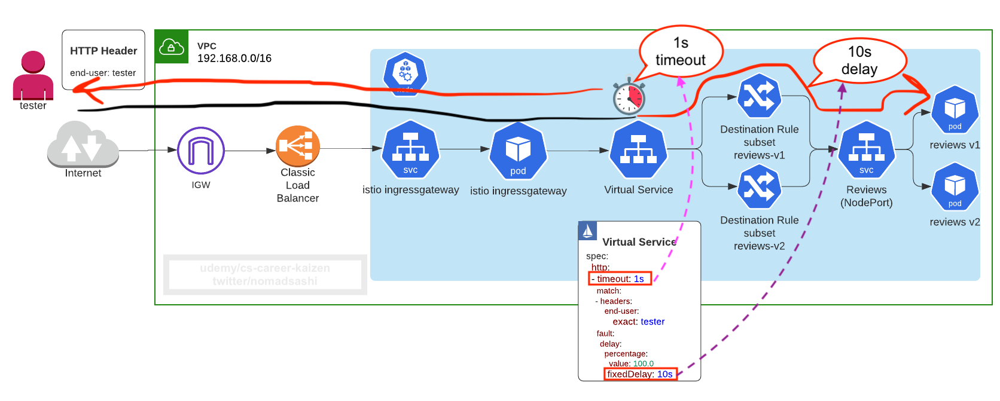
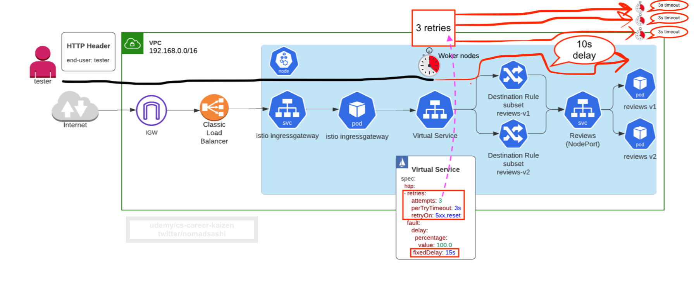
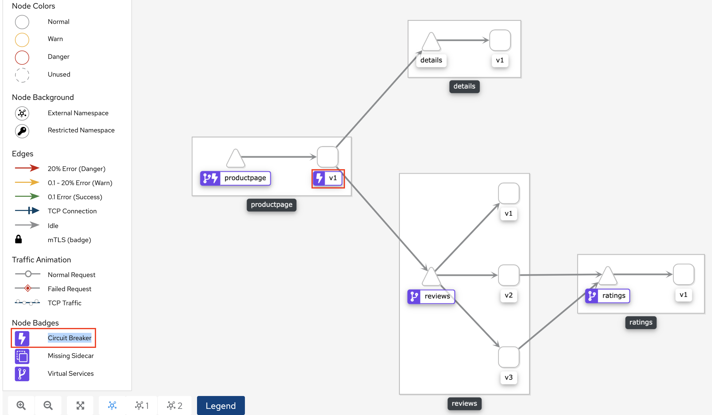

# Traffic Management

Remember in the introduction section, we talked about Istio Service Mesh Architecture:

- Data Plane (Envoy proxy)
- Control Plane (Istiod)

All traffic that your mesh services send and receive (data plane traffic) is __proxied through Envoy__, making it easy to direct and control traffic around your mesh without making any changes to your services.


To recap what Data Plane's Envoy Proxy is capable of:

- Envoy Proxy: a high-performance proxy developed in C++ to mediate all inbound and outbound traffic for all services in the service mesh. Envoy proxies are the only Istio components that interact with data plane traffic.
- Traffic control
    - a different load balancing policy to traffic for a particular subset of service instances
    - Staged rollouts with %-based traffic split
    - HTTP/2 and gRPC proxies
- Network resiliency
    - Timeouts
    - Retries
    - Circuit breakers
    - Fault injection
- Security and Authentication
    - rate limiting
    - TLS termination
- __Istio Resources that enable above features__
    - __Virtual services__   # < ----- what is this?
        - without VirtualService, Envoy distributes traffic using round-robin load balancing between all service instances. This is what __K8s service's L4 load balancing__ can do for you.
    - __Destination rules__
    - __Gateways__
    - Service entries
        - if the destination’s host is outside Istio service mesh (e.g. AWS RDS endpoint), __non-mesh service needs to be added using a service entry__
    - Sidecars

In my personal experience, I didn't implement all of this traffic management features, only the most important ones, obviously because of the project deadline. 

Here are the prioritized traffic management design implemented:

## Timeout configuraiton for Resilience Testing using VirtualService




A timeout is the amount of time that an Envoy proxy should wait for replies from a given service, ensuring that services don’t hang around waiting for replies indefinitely and that calls succeed or fail within a predictable timeframe. The __default timeout for HTTP requests is 15 seconds__, which means that if the service doesn’t respond within 15 seconds, the call fails.


Istio lets you easily adjust timeouts dynamically on a per-service basis using virtual services __without having to edit your service code__.

For example, let's configure 3 seconds timeout for the dispatch virtual service:

```yaml hl_lines="11"
apiVersion: networking.istio.io/v1alpha3
kind: VirtualService
metadata:
  name: aidc-dispatch-vs
spec:
  hosts: # destinations that these routing rules apply to. VirtualService must be bound to the gateway and must have one or more hosts that match the hosts specified in a server
  - "*"
  gateways: # names of gateways and sidecars that should apply these routes
  - dispatch-gateway # Don't ONLY USE this gateway as "reviews" k8s service is used internally by productpage service, so this VS rule should be applied to Envoy sidecar proxy inside reviews pod, not edge proxy in gateway pod.
  http: # L7 load balancing by http path and host, just like K8s ingress resource
  - timeout: 3s # <--- default timeout for HTTP requests is 15 seconds, which means that if the service doesn’t respond within 15 seconds, the call fails
    route:
    - destination:
        host: dispatch-svc
        port:
          number: 444
```

Apply
```
oc apply -f virtualservice-dispatch.yaml
```

## Configure Retry for Resilience Testing using VirtualService




The following example configures a maximum of 3 retries to connect to dispatch service subset after an initial call failure, each with a 3 second timeout.

```yaml title="virtualservice-dispatch.yaml" hl_lines="13 14 15 16"
apiVersion: networking.istio.io/v1alpha3
kind: VirtualService
metadata: 
  name: aidc-dispatch-vs
  namespace: keycloak-servicemesh
spec:
  hosts:
  - "*"
  gateways:
  - dispatch-gateway
  http:
  - timeout: 3s
  - retries:
      attempts: 3 # default 1. The number of retries for a given request. The interval between retries will be determined automatically (25ms+). Actual number of retries attempted depends on the request timeout
      perTryTimeout: 3s
      retryOn: 5xx,gateway-error,reset,connect-failure,refused-stream,retriable-4xx
  - name: "dispatch-route"
    route:
    - destination:
        host: dispatch-svc
        port:
          number: 444
```

## Enable Rate Limiting by Configuring Connection Pool sizes in DestinationRule

Connection pool settings can be applied at the TCP level as well as at HTTP level.

For example, the following yaml sets a limit of 2 concurrent connections to dispatch service with a connect timeout of 30ms.

```yaml title="destination_rules_dispatch_circuit_breaker.yaml" hl_lines="9 10 11 12 13 14"
apiVersion: networking.istio.io/v1alpha3
kind: DestinationRule
metadata:
  name: dispatch
spec:
  host: dispatch # name of a service from the service registry
  trafficPolicy: # service-level routing policy
      connectionPool: # <------  ref: https://istio.io/latest/docs/reference/config/networking/destination-rule/#ConnectionPoolSettings
        http:
          http2MaxRequests: 1 # limit of 50 concurrent HTTP2 requests
          maxRequestsPerConnection: 1
        tcp:
          maxConnections: 2 # connection pool size of 2 HTTP1 connections
          connectTimeout: 30ms
          tcpKeepalive:
            time: 7200s
            interval: 75s
```

## Enable Circuit Breaker by Configuring OutlierDetection in DestinationRule
Refs:
- https://istio.io/latest/docs/tasks/traffic-management/circuit-breaking/
- https://istio.io/latest/docs/concepts/traffic-management/#circuit-breakers

- HTTP services
    - hosts that continually return 5xx errors for API calls are ejected from the pool for a pre-defined period of time
- TCP services
    - connection __timeouts__ or connection __failures__ to a given host counts as an error when measuring the consecutive errors metric


In this yaml configures dispatch upstream hosts to be __scanned every 1 second__ so that any host that __fails 1 consecutive time__ with a 502, 503, or 504 error code will be __ejected for 3 minutes__.

```yaml title="destination_rules_dispatch_circuit_breaker.yaml" hl_lines="18 19 20 21"
apiVersion: networking.istio.io/v1alpha3
kind: DestinationRule
metadata:
  name: dispatch
spec:
  host: dispatch # name of a service from the service registry
  trafficPolicy: # service-level routing policy
      connectionPool: # ref: https://istio.io/latest/docs/reference/config/networking/destination-rule/#ConnectionPoolSettings
        http:
          http2MaxRequests: 1 # limit of 1 concurrent HTTP2 requests
          maxRequestsPerConnection: 1
        tcp:
          maxConnections: 2 # connection pool size of 2 HTTP1 connections
          connectTimeout: 30ms
          tcpKeepalive:
            time: 7200s
            interval: 75s
      outlierDetection: # <-----  ref: https://istio.io/latest/docs/reference/config/networking/destination-rule/#OutlierDetection
        consecutiveErrors: 1
        interval: 1s # scans every 1s
        baseEjectionTime: 3m 
```

Apply 
```
oc apply -f destination_rules_dispatch_circuit_breaker.yaml
```

You will see Circuit Breaker icon on `productpage` workload on Kiali:



### How to Test Circuit Breaker

While the following example is for kubernetes, the sames goes for Openshift.

Create a fortio pod
```sh
# create a pod
kubectl apply -f ../istio-1.6.7/samples/httpbin/sample-client/fortio-deploy.yaml

# test curl the bookinfo productpage URL
FORTIO_POD=$(kubectl get pods -lapp=fortio -o 'jsonpath={.items[0].metadata.name}')
BOOKINFO_URL=$(echo $(kubectl -n istio-system get service istio-ingressgateway -o jsonpath='{.status.loadBalancer.ingress[0].hostname}')/productpage)

kubectl exec -it "$FORTIO_POD" -c fortio -- /usr/bin/fortio load -curl "$BOOKINFO_URL"
```

Now make tons of request
```sh
# Call the service with two concurrent connections (-c 2) and send 20 requests (-n 20)
kubectl exec -it "$FORTIO_POD" -c fortio -- /usr/bin/fortio load -c 2 -qps 0 -n 20 -loglevel Warning "$BOOKINFO_URL"

# output
15:49:54 I logger.go:114> Log level is now 3 Warning (was 2 Info)
Fortio 1.6.5 running at 0 queries per second, 2->2 procs, for 20 calls: a5a1acc36239d46038f3dd828465c946-706040707.us-west-2.elb.amazonaws.com/productpage
15:49:54 W http_client.go:143> Assuming http:// on missing scheme for 'a5a1acc36239d46038f3dd828465c946-706040707.us-west-2.elb.amazonaws.com/productpage'
Starting at max qps with 2 thread(s) [gomax 2] for exactly 20 calls (10 per thread + 0)
Ended after 624.901397ms : 20 calls. qps=32.005
Aggregated Function Time : count 20 avg 0.060465896 +/- 0.01994 min 0.025406513 max 0.086700868 sum 1.20931791
# range, mid point, percentile, count
>= 0.0254065 <= 0.03 , 0.0277033 , 15.00, 3
> 0.03 <= 0.035 , 0.0325 , 25.00, 2
> 0.05 <= 0.06 , 0.055 , 30.00, 1
> 0.06 <= 0.07 , 0.065 , 65.00, 7
> 0.07 <= 0.08 , 0.075 , 90.00, 5
> 0.08 <= 0.0867009 , 0.0833504 , 100.00, 2
# target 50% 0.035
# target 75% 0.07
# target 90% 0.08
# target 99% 0.0927821
# target 99.9% 0.0934081
Sockets used: 11 (for perfect keepalive, would be 2)
Jitter: false
Code 200 : 10 (50.0 %)
Code 503 : 10 (50.0 %) # <------- half returning 5xx
Response Header Sizes : count 20 avg 84 +/- 84 min 0 max 168 sum 1680
Response Body/Total Sizes : count 20 avg 2811.3 +/- 2536 min 275 max 5351 sum 56226
All done 20 calls (plus 0 warmup) 38.917 ms avg, 31.2 qps
```

These were trapped by circuit breaking
```sh
Code 200 : 10 (50.0 %)
Code 503 : 10 (50.0 %) # <------- half returning 5xx
```