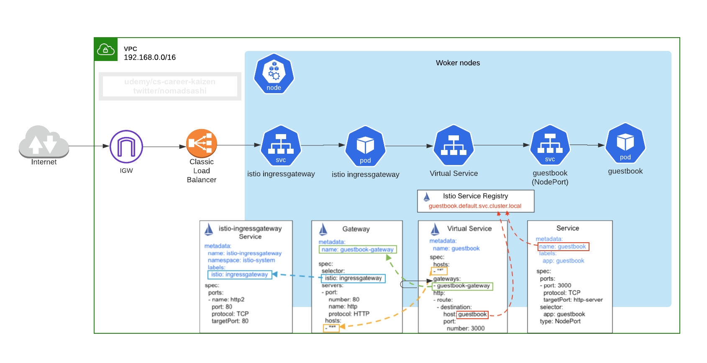
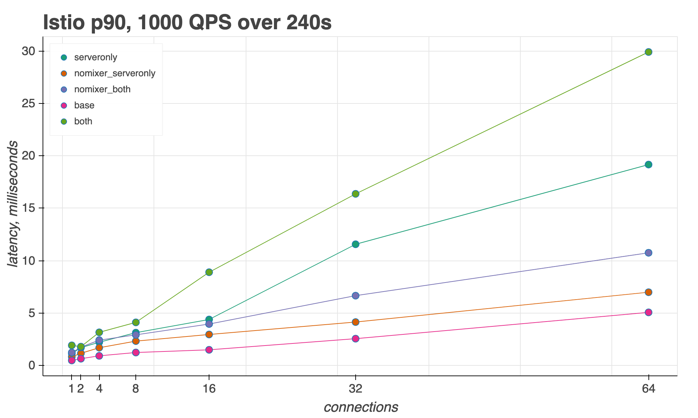

# 1. Why Istio

Ref: https://istio.io/blog/2020/tradewinds-2020/

Service mesh requirements can be thought of as a typical __API gateway__ functionality, but instead of having just one API gateway, consider each sidecar Envoy proxies acting as API gateway:

## Benefits:

### [Traffic Management](https://istio.io/docs/concepts/traffic-management/)
- Control Ingress Traffic using Gateway, VirtualService, DestinationRules
 
### Load balancing 

### Service Entry
Provides the ability to manually define endpoints that cannot be auto-discovered and may represent destinations outside of the mesh (location: MESH_EXTERNAL).
### Request Routing
Fine-grained control of traffic behavior with rich routing rules, retries, failovers, and __fault injection__
- TLS termination

### Canary rollouts

### Identity/header based routing
    
### Failure recovery (delay, abort, retries, timeout)

### Mirror live traffic

### Rate limiting
### Circuit breaker
### Control egress traffic
### [Security](https://istio.io/docs/concepts/security/)
- transparently secure traffic behind the firewall ([Auto mutual TLS among backend services](https://istio.io/docs/tasks/security/authentication/authn-policy/#auto-mutual-tls), [which doubles the latency at max or max 10ms](https://github.com/istio/tools/tree/3ac7ab40db8a0d595b71f47b8ba246763ecd6213/perf/benchmark#run-performance-tests), [also explained in Istio best practice blog](https://istio.io/blog/2019/performance-best-practices/#3-measure-with-and-without-proxies))

### End-to-end authentication and authorization using JWT

### Observability
- Debug the latency in the overall architecture

- Automatic metrics, logs, and traces for all traffic within a cluster, including cluster ingress and egress
    
- Raw telemetry data are sent from envoy proxy to Mixer, which Mixer processes into metrics, traces, and other telemetry
- New in istio 1.5 and 1.6
    - Reduced installation and configuration complexity by moving control plane components into a single component: __Istiod__. This binary includes the features of Pilot, Citadel, Galley, and the sidecar injector
    - High performant ([Istio Performance Benchmarking and script](https://github.com/istio/tools/tree/3ac7ab40db8a0d595b71f47b8ba246763ecd6213/perf/benchmark#run-performance-tests), [egress gateway performance testing](https://istio.io/blog/2019/egress-performance/))
         
         

- Refs:
    - [Istio with Kubernetes on AWS](https://github.com/aws-samples/istio-on-amazon-eks)
    - [Kiali: Istio dashboard](https://kiali.io/)
    - [Istio sidecar injection failing with error - MountVolume.SetUp failed for volume "istiod-ca-cert" : configmap "istio-ca-root-cert" not found #22463](https://github.com/istio/istio/issues/22463)
    - [Failed to get secret "istio-ca-secret" thus istiod pod's readiness probe fails on EKS #24009](https://github.com/istio/istio/issues/24009)